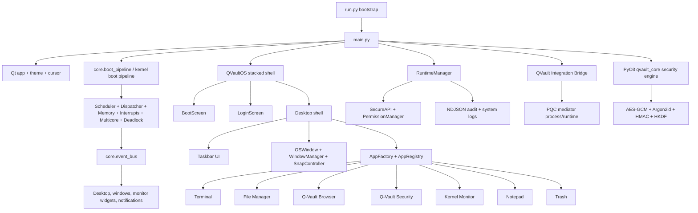
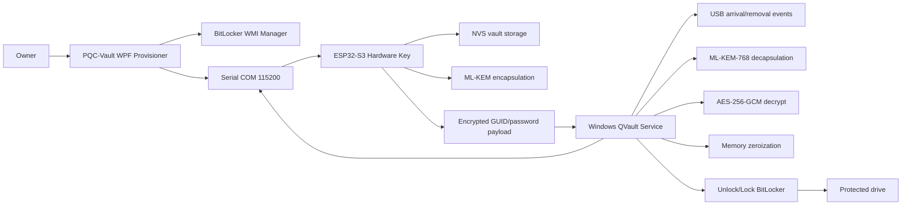
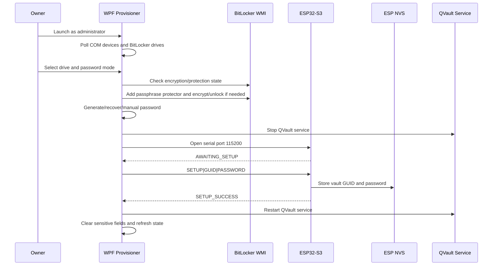
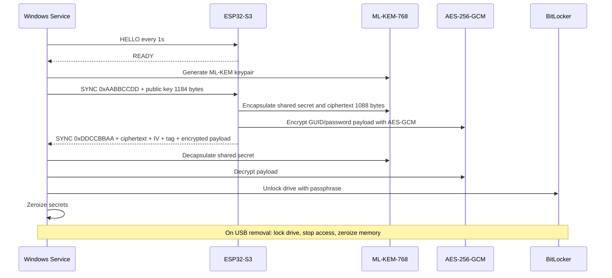
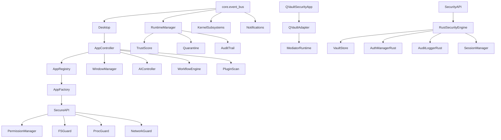

# Q-Vault Master Knowledge Base

Generated: 2026-05-07  
Repository: `c:\Users\eltmsah\Desktop\Github\Q-Vault`  
Purpose: forensic project analysis and complete website/presentation blueprint for Q-Vault OS and the Q-Vault post-quantum hardware security system.

## 0. Executive Reality Map

Q-Vault is not one single artifact. The repository contains two strongly related product layers that should be presented as one integrated security ecosystem, while still being honest about which parts are implemented in this repo and which parts are documented architecture.

| Layer | What It Is | Implementation Status In This Repo | Presentation Meaning |
|---|---|---:|---|
| Q-Vault OS Simulator | PyQt5 desktop operating-system simulator with custom shell, app launcher, taskbar, windows, kernel monitor, terminal, sandboxing, runtime governance, Rust security core bindings, and cyber-themed UI. | Present in source. Runs through `run.py` / `main.py` if dependencies and Rust core are healthy. | The cinematic OS interface, product atmosphere, dashboard, terminal, app windows, kernel visualization, and brand identity source. |
| Q-Vault PQC Provisioner | C# WPF provisioning app for BitLocker and ESP32 token setup. | Present under `subsystems/pqc-mediator/PQC-Vault` and compiled runtime under `binaries`. | The real provisioning flow: choose drive, password/seed mode, encrypt, push vault credentials to hardware. |
| Windows Service Middleware | C service described in markdown docs: monitors USB, performs ML-KEM handshake, unlocks/locks BitLocker. | Documentation only in this repo. Some runtime logs exist through the Python integration adapter. | The invisible trust broker: the "guardian service" that converts physical token presence into disk unlock. |
| ESP32-S3 Firmware | ESP-IDF/FreeRTOS firmware described in docs: setup mode, vault mode, factory reset, ML-KEM encapsulation, AES-GCM encrypted payload. | Documentation only in this repo. Firmware files are referenced but not present. | The physical ownership object, LED ritual, hardware trust anchor, and the most important 3D/photography subject. |
| Future Roadmap | Mobile companion, BLE kill switch, SafeZone/UnsafeZone, VeraCrypt support, hidden volumes, cascaded algorithms, stronger hardware storage. | Present in roadmap docs. | The future-proofing narrative: from BitLocker unlocker to quantum-safe data custody platform. |

The presentation website should therefore use a layered claim model:

1. "Q-Vault OS" is the immersive operating environment and demonstration surface.
2. "Q-Vault Hardware Security System" is the post-quantum BitLocker/ESP32 architecture.
3. "Q-Vault Roadmap" extends the system toward mobile custody, VeraCrypt, SafeZone, and cross-platform vaulting.

## 1. Full Project Forensics

### 1.1 Repository State

| Signal | Finding |
|---|---|
| Git status | Untracked documentation exists: `docs/`, `q_vault_documentation.md`, `q_vault_full_architecture.md`, `q_vault_future_roadmap.md`. |
| Ignored/generated files | `.logs/`, `logs/`, and many `__pycache__/` directories are present locally. |
| Runtime logs | `.logs/system.log` contains repeated cold-start cleanup entries. `.logs/audit_trail.ndjson` is empty. `logs/qvault/integration.log` records mediator start/stop attempts, including repeated exits with `2147516570` and later exits `0`/`1`. |
| Binaries | Large .NET runtime bundle under `binaries`; Rust/Python binary artifacts under `core/binaries`. These are product/runtime artifacts, not website assets. |
| Build health | Rust `cargo check --quiet` currently fails with 36 errors. See "Problems Discovered". |

### 1.2 Folder Tree

This is the forensic folder tree excluding `.git` object internals. `.gitignore` and repository state were inspected; the VCS object database is not a product artifact.

```text
.
|-- .logs
|   |-- apps
|-- apps
|   |-- browser
|   |   |-- __pycache__
|   |-- file_manager
|   |   |-- __pycache__
|   |-- notepad
|   |   |-- __pycache__
|   |-- qvault_security
|   |   |-- __pycache__
|   |-- system_monitor
|   |-- terminal
|   |   |-- __pycache__
|   |-- trash
|   |   |-- __pycache__
|   |-- vault_browser
|-- assets
|   |-- icons
|   |-- screenshots
|-- binaries
|-- components
|   |-- __pycache__
|   |-- systray
|   |   |-- __pycache__
|-- core
|   |-- __pycache__
|   |-- binaries
|-- desktop
|   |-- applications
|-- docs
|-- integrations
|   |-- qvault
|   |   |-- __pycache__
|-- kernel
|   |-- __pycache__
|   |-- security
|-- logs
|   |-- qvault
|-- src
|-- subsystems
|   |-- pqc-mediator
|   |   |-- PQC-Vault
|-- system
|   |-- __pycache__
|   |-- ai
|   |   |-- __pycache__
|   |-- automation
|   |   |-- __pycache__
|   |-- marketplace
|   |   |-- plugins
|   |-- plugins
|   |-- runtime
|   |-- sandbox
|   |   |-- __pycache__
|   |-- security
|   |   |-- __pycache__
|   |-- services
|   |   |-- __pycache__
|-- users
|   |-- admin
|   |   |-- Documents
|   |   |-- Downloads
|   |   |-- Pictures
|   |   |-- Projects
|   |-- default
|       |-- Documents
|       |-- Downloads
|       |-- Pictures
|       |-- Projects
```

### 1.3 File Type Distribution

| Type | Count | Role |
|---:|---:|---|
| `.dll` | 238 | Bundled .NET runtime and WPF dependency payload for PQC-Vault. |
| `.py` | 185 | Main Q-Vault OS simulator, apps, components, kernel, sandbox, services. |
| `.pyc` | 123 | Generated caches. Should not be used as authoritative source. |
| `.rs` | 14 | Rust security core, PyO3 bridge, crypto, vault, audit, auth, attestation. |
| `.svg` | 14 | Iconography and logo system. |
| `.md` | 8 | Root README and project/architecture/roadmap/report docs. |
| `.log` | 8 | Runtime logs, mostly empty except kernel cleanup and QVault integration logs. |
| `.json` | 6 | Runtime configs and app/security manifests. |
| `.cs` | 4 | WPF provisioning application and BitLocker manager. |
| `.exe` | 3 | Bundled Windows executables for PQC-Vault runtime. |
| `.docx` | 2 | Final document plus Word lock/temp artifact. |
| `.xaml` | 2 | WPF app and main window UI. |
| `.pdf` | 2 | Final report and an Arabic PDF artifact. |
| Other | various | `.toml`, `.lock`, `.csproj`, `.sln`, `.manifest`, `.pdb`, `.pyd`, `.png`, `.jpg`, `.txt`, `LICENSE`, `.gitignore`. |

### 1.4 Technology and Library Detection

| Domain | Technologies |
|---|---|
| Main GUI OS | Python, PyQt5, PyQtWebEngine, Qt widgets, QSS styling, QPropertyAnimation, QGraphicsOpacityEffect. |
| Security core | Rust, PyO3, AES-GCM, Argon2id, HKDF, HMAC-SHA256, SHA-256, rand, zeroize, subtle, serde, chrono, uuid, Windows bindings. |
| Provisioner | C#, WPF, .NET 9 Windows, XAML, NBitcoin, System.IO.Ports, System.Management, app manifest with admin elevation. |
| OS integrations | BitLocker WMI namespace `root\CIMv2\Security\MicrosoftVolumeEncryption`, PowerShell/BitLocker commands in docs, serial COM port scanning, Windows service control. |
| Hardware architecture | ESP32-S3, ESP-IDF, FreeRTOS, NVS, GPIO0 factory reset, UART/USB serial, CH340 VID/PID `VID_1A86&PID_55D3`. Firmware code is documented but not present. |
| Cryptography | ML-KEM-768 / Kyber / NIST FIPS 203 in docs, AES-256-GCM, Argon2id, HMAC-SHA256, HKDF, SHA-256, BIP39 seed generation for password recovery. |
| Simulation/kernel | Custom event bus, scheduler, dispatcher, multicore engine, memory manager, deadlock manager, interrupt manager, IPC manager, thread manager. |
| Product docs | Markdown, PDF, DOCX, Arabic/English mixed strategic and technical documentation. |
| Website recommendation | Next.js App Router, TypeScript, React Server/Client Components, Motion for React, GSAP ScrollTrigger, React Three Fiber/Three.js, MDX/content-driven sections, optimized media pipeline. |

### 1.5 Importance Ranking

| Rank | File/Area | Importance | Why It Matters |
|---:|---|---:|---|
| 1 | `q_vault_documentation.md` | Critical | Contains the clearest end-to-end hardware/service/ESP32/BitLocker handshake and operational flows. |
| 2 | `q_vault_full_architecture.md` | Critical | Expands the hardware product story in Arabic/English and defines setup/daily/remove flows. |
| 3 | `subsystems/pqc-mediator/PQC-Vault/MainWindow.xaml.cs` | Critical | Actual WPF provisioning behavior: drive detection, seed mode, BitLocker operations, serial protocol. |
| 4 | `subsystems/pqc-mediator/PQC-Vault/MainWindow.xaml` | Critical | Best concrete UI source for cinematic provisioner visuals: dark glass, neon, status dot, flow panels. |
| 5 | `README.md` | Critical | Defines Q-Vault OS as secure AI-native simulator, PyQt5/Rust stack, OS promise, visual tone. |
| 6 | `main.py`, `run.py` | Critical | Boot/launch architecture and OS entry points. |
| 7 | `core/app_registry.py` | Critical | Defines app ecosystem and icons. |
| 8 | `system/runtime_manager.py` | Critical | Runtime trust, quarantine, audit, sandbox governance. Strong product storytelling asset. |
| 9 | `system/sandbox/secure_api.py` and `system/sandbox/permissions.py` | Critical | Zero-trust application boundary and security API injection model. |
| 10 | `src/*.rs` | Critical but currently unhealthy | Intended Rust security core, crypto primitives, vault, audit, auth, attestation. |
| 11 | `kernel/*.py` | High | Kernel simulation visuals and OS authenticity: scheduler, memory, interrupts, deadlocks, multicore. |
| 12 | `apps/terminal/*` | High | Rich command shell, ghost-text suggestions, sudo threat scoring, command registry. Excellent demo surface. |
| 13 | `assets/theme.py`, `assets/design_tokens.py` | High | The strongest source of brand colors, typography, radii, glow, and motion tokens. |
| 14 | `assets/qvault_vault.jpg`, `assets/screenshots/hero_mockup.png`, `assets/icons/*.svg` | High | Existing presentation imagery and icon system. |
| 15 | `q_vault_future_roadmap.md` and `docs/Q_VAULT_Full_Report.md` | High | Strategy, roadmap, target sectors, market positioning, future extensions. |
| 16 | `logs/qvault/integration.log` | Medium | Evidence of runtime adapter/mediator attempts, useful for demo/debug transparency. |
| 17 | `components/network_menu.py`, `components/quick_panel.py` | Medium risk | UI systems with broken imports to missing `tools.system_control_helper`. |
| 18 | `system/command_dispatcher.py`, `system/context_engine.py`, `system/personality_manager.py`, `system/plugin_manager.py`, `system/sequence_engine.py` | Low/current placeholder | 0-byte future systems. Good roadmap clue, not current capability. |

### 1.6 Source Code Architecture Map



### 1.7 Hardware Product Architecture Map



### 1.8 Runtime Flow: Q-Vault OS

| Step | Runtime Event | Presentation Opportunity |
|---:|---|---|
| 1 | `run.py` checks Python version, dependencies, Rust core binary, assets, and `~/.qvault`. | Boot diagnostics overlay with green/cyan checks. |
| 2 | `main.py` configures HiDPI, theme, custom cursor, first-run/onboarding state. | Cinematic "environment sealing" sequence. |
| 3 | Kernel boot starts memory, interrupt, scheduler, dispatcher, multicore, deadlock, and simulation clock systems. | Timeline of kernel modules lighting up. |
| 4 | `QVaultOS` shows boot screen, login screen, then desktop. | Scroll-driven OS reveal: black void -> boot glyph -> login glass -> desktop. |
| 5 | Desktop starts taskbar, icons, wallpaper, windows, app launcher, notifications, and runtime bridge. | Interactive browser-based OS mock/demo. |
| 6 | App launches flow through `AppFactory`, optional `SecureAPI`, window manager, and event bus. | "Apps are citizens under policy" visualization. |
| 7 | Runtime manager tracks trust score, crashes, violations, memory pressure, quarantine, and audit entries. | Threat scoreboard and quarantine animation. |

### 1.9 Runtime Flow: PQC Provisioning



### 1.10 Runtime Flow: Daily Unlock and Removal



Handshake byte inventory:

| Segment | Size |
|---|---:|
| Magic response | 4 bytes |
| ML-KEM-768 ciphertext | 1088 bytes |
| AES-GCM IV | 12 bytes |
| AES-GCM tag | 16 bytes |
| Encrypted payload buffer | 256 bytes |
| Total | 1376 bytes |

Documentation note: one architecture doc describes the response as `1372` bytes, but the listed fields add to `1376`. The website should avoid hardcoding the disputed total unless the implementation is confirmed.

### 1.11 Component Dependency Graph



### 1.12 Hidden, Experimental, Placeholder, and Broken Systems

| Area | Finding | Website/Build Implication |
|---|---|---|
| `system/command_dispatcher.py` | 0-byte placeholder. | Do not claim complete natural-language command dispatcher. Present as roadmap/foundation. |
| `system/context_engine.py` | 0-byte placeholder. | AI/context layer is conceptually present, not complete. |
| `system/personality_manager.py` | 0-byte placeholder. | Avoid claiming finished AI personality system. |
| `system/plugin_manager.py` | 0-byte placeholder. | Plugin marketplace scaffolding exists elsewhere, but manager module is empty. |
| `system/sequence_engine.py` | 0-byte placeholder. | Automation sequencing is not mature. |
| `components/first_run_wizard.py` and `components/feedback_dialog.py` | Marked quarantined from 2026-04-18. | Interesting "quarantine" visual asset; not a polished production flow. |
| `components/network_menu.py`, `components/quick_panel.py` | Import missing `tools.system_control_helper`; no `tools/` directory found. | Broken UI dependency if loaded. Good remediation task before live demo. |
| `system/runtime_manager.py` | Can create MagicMock stubs for missing/quarantined apps. | The runtime is designed to degrade instead of crash. This is a strong product story. |
| `system/security_api.py` | Future note for signed audit log. | Audit chain can be shown as future hardening. |
| `apps/terminal/_command_parser.py` | Pipeline stub marked future use. | Terminal pipe visuals can be shown, but full shell piping should be checked before demo. |
| `components/desktop.py` | Launcher stub path exists. | Some shell surfaces are incomplete/experimental. |
| `components/system_control_panel.py` | Pseudo-health placeholder logic. | Use as concept visualization, not proof of system telemetry. |
| `assets/design_tokens.py` | Comments mention placeholders. | Strong token source, but not a formal design system yet. |
| `q_vault_future_roadmap.md` | SafeZone disabled due WLAN cache issue; VeraCrypt/mobile features future. | Present roadmap transparently. |

### 1.13 Problems Discovered

| Severity | Problem | Evidence | Recommendation |
|---|---|---|---|
| Critical | Rust core does not compile with `cargo check --quiet`. | 36 errors including unresolved `crate::error`, missing `HashMap`, ambiguous `HmacSha256::new_from_slice`, likely missing `thiserror` dependency. | Fix before any developer demo or claim of Rust core production readiness. |
| High | Rust `src/path.rs` has Windows portability risk. | Imports `std::os::unix::fs as unix_fs` in a Windows project. | Gate platform-specific code with `cfg` or use Windows-compatible metadata APIs. |
| High | Some UI panels import missing module. | `tools.system_control_helper` referenced, no `tools/` folder found. | Add helper module or guard imports before live OS demo. |
| High | Firmware and C Windows service code are documentation-only in this repo. | Docs reference `main_service.c`, `serial_comm.c`, ESP-IDF files, PQClean; files absent. | Website should label these as architecture/associated projects unless code is added. |
| High | ESP32 NVS stores vault GUID/password in plaintext in current docs. | Docs explicitly describe NVS storage of GUID/password and roadmap calls for encrypted NVS/eFuse. | Roadmap must include encrypted NVS partition, eFuse keys, secure boot, flash encryption. |
| Medium | SafeZone disabled. | Docs explain WLAN scan cache false negatives. | Reframe as research prototype; do not present as active safety guarantee. |
| Medium | Handshake response size inconsistency. | Fields total 1376; one doc says 1372. | Confirm implementation or avoid exact total in marketing copy. |
| Medium | Logs show mediator exits. | `logs/qvault/integration.log` records failures/exits. | Use simulation/demo mode until runtime stability is confirmed. |
| Medium | Many generated caches and logs exist locally. | `__pycache__`, `.logs`, `logs`. | Keep website repo clean; exclude runtime caches from presentation assets. |
| Medium | Hardcoded development path in docs. | Logger path includes `C:\Users\ufo91\Desktop\QvaultLog.txt`. | Replace with ProgramData/AppData path before production. |
| Low | Word temp lock file exists. | `docs/~$VAULT_final_Document.docx` is a small lock artifact and not a valid DOCX. | Ignore/remove from polished deliverables. |

## 2. Technical System Extraction

### 2.1 Q-Vault OS Product Capabilities

| Capability | Implementation Detail | Presentation Treatment |
|---|---|---|
| Custom desktop shell | Boot/login/desktop stacked UI, taskbar, launcher, icons, windows, context menus. | Browser-based OS simulation or video loop. |
| Window manager | Custom frameless windows, focus/minimize/restore/close, snap preview, workspace handling. | Animated "secure desktop" interactions. |
| App ecosystem | Terminal, file manager, browser, security app, kernel monitor, notepad, trash. | App gallery with live mock panels. |
| Terminal | Rich Linux-style command registry, ghost text, sudo/qsu, password mode, threat scoring, audit verification. | Hacker/operator demo centerpiece. |
| Kernel monitor | Scheduler, CPU timelines, RAM map, ready queue, core monitor, deadlock graph, interrupt log. | Technical credibility section with moving diagrams. |
| Runtime governance | Trust score, quarantine, violation history, audit trail, memory pressure, degraded stubs. | Zero-trust app governance visualization. |
| Sandbox API | Guarded filesystem/process/network/system/intel APIs, strict permissions, subprocess monkey-patching. | "Applications never touch the system raw" story. |
| Rust security core | Intended authenticated users, sessions, vault store, signed audit, master key, AES-GCM, Argon2id. | Present as core architecture; avoid claiming build-passing until fixed. |
| QVault bridge | Adapter/mediator runtime interaction and logs. | Connect OS demo with hardware security narrative. |

### 2.2 PQC Hardware Security Capabilities

| Capability | Implementation/Documentation Detail | Presentation Treatment |
|---|---|---|
| Physical token trust | ESP32-S3 hardware key stores vault GUID/password and only releases via challenge flow. | 3D token, USB insertion scene, LED lifecycle. |
| Post-quantum handshake | ML-KEM-768 public key exchange; ESP encapsulates shared secret; AES-GCM protects payload. | Scroll-scrubbed packet/handshake animation. |
| BitLocker integration | WMI passphrase protector, AES-256-XTS used-space-only encryption fallback to AES-256-CBC, unlock/lock commands. | Drive state transformation: red locked disk -> cyan unlocked rail -> sealed again. |
| Zero knowledge posture | No cloud account, no server-side escrow; device possession plus encrypted local drive. | "No backend to breach" claim, carefully scoped. |
| Memory hygiene | Docs emphasize memory zeroization, hidden PowerShell stdin passphrase, log suppression. | Secret appears as light, then burns out after unlock. |
| Setup lifecycle | Empty NVS setup mode, provisioning GUI, recovery seed modes, service stop/start. | Cinematic onboarding/provisioning walkthrough. |
| Removal lifecycle | USB removal locks drive and zeroizes. | Tension/release demo: token removed, disk seals instantly. |
| Factory reset | Hold BOOT/GPIO0 5s, rapid blink countdown, wipe NVS, restart. | Hardware ritual animation and LED timeline. |

### 2.3 Security Model

| Principle | Repo Evidence | Website Copy Angle |
|---|---|---|
| Post-quantum readiness | Docs specify ML-KEM-768 / Kyber / NIST FIPS 203. | "Designed around NIST-standardized lattice-based key encapsulation." |
| Defense in depth | Hardware token, Windows service, BitLocker, AES-GCM payload, memory zeroization, OS sandbox. | "The unlock path is split across possession, cryptography, operating system policy, and disk encryption." |
| Physical ownership | ESP32 hardware must be present for daily unlock. | "The key is not a password you remember; it is an object you control." |
| Zero trust | Runtime permissions, default-deny manifests, quarantine, threat scoring. | "Every app, process, and unlock attempt is treated as untrusted until policy says otherwise." |
| Zero knowledge | No cloud backend is required by the local BitLocker/ESP32 design. | "No external service needs to know the secret." |
| Ephemeral secrets | Docs emphasize memory cleanup and hidden passphrase handling; Rust uses zeroize in places. | "Secrets exist only as briefly as the unlock requires." |
| Auditability | Runtime audit NDJSON, Rust audit logger with HMAC design, terminal verify audit command. | "Operator-grade traceability with tamper-evident direction." |

### 2.4 Threat Model Extraction

| Threat | Existing Mitigation | Visual Metaphor |
|---|---|---|
| Harvest-now-decrypt-later | ML-KEM-768 exchange instead of classical public-key exchange. | Frozen captured traffic failing to decrypt under a future quantum beam. |
| USB sniffing | Captured serial data carries KEM ciphertext and AES-GCM encrypted payload, not raw password. | Packet stream visible to attacker, payload remains sealed. |
| Stolen laptop | Drive remains BitLocker-locked without hardware token/password. | Laptop shell with dark locked drive core. |
| Stolen hardware key | Token alone does not unlock without target laptop/BitLocker environment. | Token floating near a sealed machine with no trust route. |
| MITM/replay | Magic sync frames and fresh KEM exchange; exact replay defenses should be validated. | Replay packet shatters against freshness gate. |
| RAM scraping | Memory zeroization and local password handling. | Secret vapor trail disappears after unlock. |
| Rogue app/process | SecureAPI, permission manager, runtime quarantine. | App window surrounded by policy gates. |
| Insider misuse | Terminal threat scoring and runtime trust score. | Risk meter rises with suspicious command bursts. |

## 3. Visual and Brand DNA Extraction

### 3.1 Existing Visual Assets

| Asset | Description | Website Use |
|---|---|---|
| `assets/qvault_vault.jpg` | 1376x768 RGB cinematic vault/wordmark image: metallic neon Q-VAULT title, vault door, cyan/purple beams, circuit floor, binary rain. | Best current hero source, Open Graph image base, cinematic background. |
| `assets/screenshots/hero_mockup.png` | 1024x1024 fictional dashboard: Q-Vault OS v1.2, terminal/file manager/system monitor/network threat map, cyan glow, left nav. | Product mockup section, hero overlay, dashboard inspiration. |
| `assets/icons/qvault_logo.svg` | Core Q-Vault logo mark. | Header, favicon, loader, watermark. |
| `assets/icons/icon-vault.svg` | Vault icon. | Product/security section icon. |
| Other SVG icons | Terminal, files, folder, browser, kernel monitor, trash, file types, wifi, bluetooth, sound. | OS demo UI and component iconography. |

### 3.2 Color Palette

Primary palette from `assets/design_tokens.py` and `assets/theme.py`.

| Token | Hex/RGBA | Role | Website Usage |
|---|---|---|---|
| Void black | `#01020e`, `#06080d` | Deep background | Hero void, page base. |
| Base navy | `#040f22`, `#0b1320` | OS shell background | Main section backgrounds. |
| Surface navy | `#0b162d`, `#101a2b` | Panels/windows | UI panes, diagrams, card-like repeated items only. |
| Raised surface | `#0f2842`, `#1a1a2e` | Active window surfaces | Product UI frames. |
| Steel | `#2f6183` | Structural strokes | Diagram lines, borders, icon strokes. |
| Primary cyan | `#54b1c6`, `#00e6ff` | Brand energy | Hero highlights, active controls, trust beams. |
| Bright cyan | `#7dd3e8`, `#66f2ff` | Glow/highlight | Text glints, packet trails, focus rings. |
| Cyan dim | `#3a8fa8`, `#008fa3` | Secondary accent | Subtle charts and inactive states. |
| Quantum purple | `#9c27ff` | PQC/quantum accent | Lattice field, KEM exchange, future roadmap. |
| Quantum pink | `#ff2fd1` | High-energy accent | Threat traces, rare hero highlights. |
| Success green | `#00ff88`, `#3fb950` | Unlock/safe | LED success, verified, unlocked states. |
| Warning amber | `#ffaa00`, `#d29922` | Setup/warning | Seed warning, partial risk, transition states. |
| Danger red | `#ff3366`, `#f85149` | Locked/threat | Attacks, violations, lock events. |
| Main text | `#e6f7ff`, `#d4e8f0` | High-contrast text | Body and headings. |
| Dim text | `#9ec0d5`, `#8ab0c4` | Secondary copy | Captions, metadata, technical labels. |
| Muted text | `#6b8a9e`, `#4a6880` | Low emphasis | Background telemetry, disabled labels. |
| Border subtle | `rgba(84,177,198,0.12)`, `rgba(0,230,255,0.08)` | Panel separation | Fine UI outlines. |
| Border active | `rgba(84,177,198,0.5)`, `rgba(0,230,255,0.3)` | Focus/active | Active cards, selected diagram node. |
| Glow cyan | `rgba(84,177,198,0.18)`, `rgba(0,230,255,0.25)` | Ambient glow | Use sparingly around important artifacts. |

Palette rule for the presentation site: do not make the site only cyan-on-navy. Use cyan as trust energy, purple as post-quantum mathematics, green as verified possession, amber as provisioning risk, and red/pink as adversarial tension.

### 3.3 Typography System

| Role | Existing Source | Recommended Web Equivalent | Usage |
|---|---|---|---|
| Display/brand | Segoe UI Black/Semibold in QSS/XAML | `Inter`, `Segoe UI`, or licensed geometric display font | Hero title, section titles, metric numbers. |
| UI text | Segoe UI / Inter | `Inter`, `Segoe UI`, system sans | Navigation, body copy, UI labels. |
| Technical/terminal | Consolas / Cascadia Code | `Cascadia Code`, `JetBrains Mono`, `IBM Plex Mono` | Byte sequences, terminal, protocol, code snippets. |
| Status microcopy | Segoe UI Semibold, all caps | Same sans with restrained tracking | Labels like `HARDWARE TOKEN`, `LOCKED`, `READY`. |

Recommended hierarchy:

| Level | Size Direction | Weight | Notes |
|---|---:|---:|---|
| Hero H1 | 64-104 desktop, 40-56 mobile | 800-900 | Literal brand/product name: `Q-VAULT`. |
| Section H2 | 36-56 desktop, 28-36 mobile | 700 | Short, technical, cinematic. |
| Panel title | 18-24 | 650-750 | Avoid huge text inside compact panels. |
| Body | 16-18 | 400-500 | Clear and serious. |
| Technical labels | 12-14 | 600 | Uppercase allowed, letter spacing restrained. |
| Terminal text | 13-15 | 400-600 | Monospace, high contrast. |

### 3.4 Iconography

| Trait | Evidence | Direction |
|---|---|---|
| Shape language | Rounded square 64px icons with vault/security motifs. | Use custom Q-Vault SVG icons for product-specific symbols. |
| Stroke style | Steel/cyan outlines and dark navy fills. | Keep 1.5-2px consistent strokes on web. |
| Motifs | Vault dial, lock, hex/circuit frames, terminal prompt, folder/file glyphs, system indicators. | Convert to a unified web sprite or React components. |
| Generic UI icons | System tray wifi/bluetooth/sound, taskbar controls. | Use lucide icons for generic controls; preserve Q-Vault icons for branded app identities. |

### 3.5 Spacing, Radius, and Window Language

| System | Existing Clues | Recommended Web Rule |
|---|---|---|
| Radius | 4, 8, 12, 14, 22, pill. WPF cards use around 12. | 4px for controls, 8px for cards/windows, 12px for modal/product shells. Avoid excessive rounding. |
| Borders | Thin cyan/white alpha borders. | 1px lines with glow only on focus or active state. |
| Surfaces | Dark glass panels, semi-transparent overlays, raised surfaces. | Use glass for OS windows and diagrams, not for every section. |
| Grid | Dashboard and OS panes are dense, operational, scan-friendly. | Use command-center layouts, not marketing card sprawl. |
| Controls | Icon-first buttons, small status chips, tabs, sidebars. | Favor real tool controls in demos; avoid explanatory UI text inside the app mock. |

### 3.6 Motion Design Guide

| Motion | Existing Evidence | Website Translation |
|---|---|---|
| Boot reveal | Boot pipeline, splash fade in/out, loader diagnostics. | Initial hero can wake from black with protocol ticks and vault glow. |
| Window spawn | QPropertyAnimation geometry/opacity, 150-250ms. | OS panels slide/fade into place, subtle scale only. |
| Focus pulse | Window focus/fade and glow. | Active panel gains cyan border and ambient bloom. |
| Minimize/restore | Scale/fade. | Scroll sections can collapse app windows into taskbar. |
| Snap preview | 150ms opacity overlay. | Architecture nodes snap into place on scroll. |
| Notification toast | Slide/fade with hover pause. | Threat alerts and verification events appear as timed toasts. |
| WPF status dot | 1s pulsing dot. | Hardware token status LED: idle, awaiting setup, success, reset. |
| Provisioner fade | Flow containers fade in 0.4s. | Multi-step setup walkthrough. |
| Packet movement | Implied by serial/KEM handshake. | Thin cyan/purple packet beams between laptop and token. |

Motion personality: precise, surgical, calm under pressure. Use short transitions for UI, longer cinematic scroll scenes for quantum/architecture. Avoid decorative floating blobs; if particles are used, make them meaningful: packets, lattice points, entropy fields, or audit events.

### 3.7 Brand Identity Guide

| Dimension | Direction |
|---|---|
| Brand archetype | Classified cyber lab meets owner-controlled vault. |
| Personality | Quietly elite, technical, uncompromising, physical, post-quantum, not consumer gimmickry. |
| Core promise | "A physical post-quantum key that controls encrypted storage without exposing the secret." |
| Emotional arc | Threat appears enormous -> system decomposes it -> owner regains control -> secrets vanish from memory. |
| Visual mood | Black/navy void, cyan trust beams, purple quantum lattice, steel hardware, green verified LED, amber setup warnings, red attack surfaces. |
| Copy tone | Short, precise, proof-led. Avoid vague "military grade" claims unless tied to concrete mechanisms. |
| Credibility posture | Show byte sizes, protocols, architecture, WMI/BitLocker integration, NIST standard reference, and honest roadmap gaps. |

### 3.8 UI Component Catalog

| Component | Source | Website Use |
|---|---|---|
| Boot screen | `components/boot_screen.py` | Intro animation and OS simulator start. |
| Login screen | `components/login_screen.py` | "secure operator session" moment. |
| Desktop | `components/desktop.py` | Main interactive OS demo. |
| Taskbar | `components/taskbar_ui.py` | Persistent OS navigation in demo. |
| OS window | `components/os_window.py` | Draggable/snap-able product panes. |
| Launcher/search | `components/modern_launcher.py`, command palette | App discovery. |
| Notifications | `components/notification_center.py`, `components/notification_toast.py` | Threat/verification events. |
| Control center | `components/control_center.py`, `quick_panel.py` | System settings and status dashboard. |
| Terminal | `apps/terminal/*` | Developer/security operator demo. |
| File manager | `apps/file_manager/*` | Vault file browsing metaphor. |
| QVault Security | `apps/qvault_security/*` | Hardware/mediator status dashboard. |
| Kernel Monitor | `kernel/app.py` | OS internals and credibility visualization. |
| WPF Provisioner | `subsystems/pqc-mediator/PQC-Vault/MainWindow.xaml` | Setup story and screenshot/video subject. |

## 4. Presentation Website Strategy

### 4.1 Sitemap

```text
/
|-- Hero: Q-VAULT
|-- Problem: The quantum/physical custody gap
|-- Product: Hardware key + OS + service + encrypted drive
|-- Live OS: Q-Vault desktop showcase
|-- Protocol Lab: ML-KEM handshake
|-- Provisioning: Drive setup and recovery seed
|-- Hardware Lifecycle: setup, vault, reset
|-- Threat Model: what Q-Vault blocks
|-- Architecture Explorer
|-- Roadmap: mobile, SafeZone, VeraCrypt
|-- Evidence: docs, demos, logs, implementation notes
|-- CTA: request demo / view docs / build notes

/architecture
/protocol
/os
/provisioner
/roadmap
/assets
```

### 4.2 Landing Page Section Hierarchy

| Section | Purpose | Emotional Goal | UX Goal | Motion/Interaction | Layout and Visual Treatment |
|---|---|---|---|---|---|
| 1. Hero: Q-VAULT | Establish brand and product instantly. | Awe, control, classified-lab confidence. | Communicate hardware-secured post-quantum vault in first viewport. | Full-bleed vault/hardware/OS scene; USB insertion scrub; cyan title glow. | Use `qvault_vault.jpg` or a generated/rendered hardware scene as background, not a card. Keep next section peeking below. |
| 2. The Threat Window | Explain HNDL, stolen laptops, USB sniffing, password exposure. | Controlled anxiety. | Make the security problem tangible without fear-mongering. | Red/pink attack paths converge on a drive; captured packets freeze. | Split timeline of attack surfaces with concise proof points. |
| 3. The Trust Stack | Introduce ESP32, ML-KEM, AES-GCM, BitLocker, Windows service, OS. | Relief through structure. | Show the system is layered and concrete. | Layers assemble vertically from hardware to OS. | Architecture cross-section with interactive layer hover. |
| 4. Q-Vault OS Live Surface | Showcase the PyQt OS aesthetic and apps. | Immersion. | Let visitors inspect terminal, kernel monitor, file manager, security dashboard. | Browser mock OS with draggable/focusable panes, or video with interactive hotspot overlay. | Full-width command center, not a marketing grid. |
| 5. Protocol Lab | Teach the handshake. | Technical fascination. | Convert crypto into a visible sequence. | Scroll-scrubbed sequence diagram: HELLO, READY, public key, ciphertext, IV/tag/payload, zeroization. | Left protocol timeline, right animated laptop-token data path. |
| 6. Provisioning Flow | Show setup credibility. | Practical trust. | Explain how a drive becomes bound to the hardware key. | WPF panels fade through drive selection, seed generation, encryption, token provisioning. | Use real screenshots/video of provisioner states. |
| 7. Hardware Lifecycle | Make the token feel real. | Ownership and ritual. | Teach setup mode, vault mode, factory reset, LED language. | LED pattern animation: solid, blink five times, silent, rapid countdown, reset. | 3D token model with state rail. |
| 8. Zero-Knowledge Custody | Clarify no backend/escrow requirement. | Privacy and control. | Explain where secrets do and do not live. | Secret moves token -> encrypted tunnel -> BitLocker, then vanishes. | Data-flow map with negative spaces labeled "not cloud", "not logs", "not command line". |
| 9. Runtime Governance | Showcase OS sandbox/trust score/quarantine. | Operational power. | Show Q-Vault OS has a security personality beyond visuals. | App trust meters update; rogue process is quarantined. | Dense dashboard with runtime cards, audit trail, policy gates. |
| 10. Threat Model Wall | Summarize mitigations. | Confidence. | Allow security buyers to scan threat coverage. | Hover each threat to reveal mitigation path. | Matrix of threat -> control -> evidence -> residual risk. |
| 11. Roadmap Console | Show future without overclaiming. | Momentum. | Present mobile BLE kill switch, SafeZone, VeraCrypt, encrypted NVS, TPM. | Timeline nodes energize from prototype to hardened platform. | Roadmap bands: near, next, research. |
| 12. Evidence and Transparency | Show implementation health, docs, known gaps. | Credibility. | Earn trust through honesty. | Build/status badges, code snippets, artifact inventory. | Technical appendix style, compact and direct. |
| 13. Final CTA | Invite demo/repo/contact. | Resolve and action. | Make next step obvious. | Vault seal closes and glows green. | Short CTA with product mark and demo links. |

### 4.3 Interactive Visualization Opportunities

| Visualization | Input Source | Implementation Idea |
|---|---|---|
| USB insertion simulator | Hardware docs + WPF detection flow | 3D token slides into laptop; COM status switches from `NO TOKEN` to `READY`. |
| ML-KEM handshake | Protocol byte sizes from docs | Scroll timeline with packets. Use actual sizes as labels and animated packet chunks. |
| BitLocker drive state | `BitLockerManager.cs` | Drive object changes status: unencrypted -> encrypting percent -> protected -> unlocked -> locked. |
| Kernel scheduler | `kernel/scheduler.py`, `kernel/app.py` | Live animated ready queue and CPU core lanes. |
| Memory map | `kernel/memory_manager.py` | Regions lock/unlock when QVault state changes. |
| Runtime trust score | `system/runtime_manager.py` | App cards show trust decay, violation, quarantine overlay, recovery. |
| Terminal simulator | `apps/terminal/_commands.py` | Limited web terminal with real command list and ghost suggestion behavior. |
| WPF provisioner | XAML + screenshots | Recreate as high-fidelity web component or use video/screenshot carousel. |
| LED pattern explorer | Firmware docs | State selector with LED strip/dot animation and serial messages. |
| Threat replay | Docs threat model | Attacker captures USB traffic; payload remains sealed; removal locks drive. |

### 4.4 Cinematic Storytelling Structure

1. The future threat is not abstract: encrypted traffic captured today may be attacked later.
2. Q-Vault refuses to trust memory, software, cloud, USB, or user habits alone.
3. A physical ESP32-S3 token becomes the owner-controlled trust object.
4. The Windows service asks the token for proof through a fresh post-quantum exchange.
5. The token never sends the BitLocker secret in cleartext over the wire.
6. The drive unlocks locally, secrets are zeroized, and the OS records the state.
7. Removing the object collapses trust and seals the drive again.
8. Q-Vault OS turns this invisible custody model into an inspectable command center.

## 5. Technical Storytelling Extraction

### 5.1 User Journey Narrative

| Stage | User Action | System Response | Story Beat |
|---|---|---|---|
| First contact | User opens provisioner as admin. | App detects hardware token and BitLocker drives. | "The vault recognizes the machine." |
| Drive selection | User chooses target drive. | WMI checks encryption/protection state. | "Storage becomes a controlled surface." |
| Secret creation | User enters password, generates seed, or recovers from seed. | App resolves a BitLocker passphrase and can force seed backup. | "Human recovery is acknowledged, not ignored." |
| Encryption | User starts setup. | BitLocker protector/encryption is configured and progress tracked. | "The disk is transformed into a sealed vault." |
| Hardware binding | App sends setup payload to ESP32. | Token stores GUID/password and confirms setup. | "The vault is bound to a physical key." |
| Daily use | User inserts token. | Service performs handshake and unlocks drive. | "Possession opens the vault." |
| Removal | User removes token. | Service locks drive and wipes memory. | "Trust disappears when the key disappears." |

### 5.2 Marketing-Ready Explanation

Q-Vault binds encrypted storage to a physical post-quantum hardware key. Instead of depending only on a remembered password or cloud account, Q-Vault uses an ESP32-S3 token, a local Windows service, BitLocker, and a fresh ML-KEM-768 handshake to unlock a protected drive only when the trusted hardware is present. The Q-Vault OS interface turns the entire security posture into a visible command center: terminal, kernel monitor, runtime policy, app quarantine, and hardware status all in one futuristic desktop.

### 5.3 Technical Explanation

Q-Vault's documented unlock path starts when the Windows service detects the ESP32-S3 device over USB serial. The service sends `HELLO`, receives `READY`, creates an ML-KEM-768 keypair, and sends a sync frame plus the 1184-byte public key. The ESP32 encapsulates a 32-byte shared secret, encrypts the locally stored vault GUID/password payload with AES-256-GCM, and returns the KEM ciphertext plus IV, tag, and encrypted payload. The service decapsulates, decrypts, unlocks BitLocker through local Windows mechanisms, and zeroizes sensitive material. Provisioning is handled by a WPF admin app that configures BitLocker, supports manual/seed/recovery password modes, and writes the vault binding to the ESP32 setup mode.

### 5.4 Investor-Friendly Explanation

Q-Vault addresses the collision of three market forces: post-quantum migration, endpoint data protection, and physical ownership of sensitive storage. Its wedge is narrow and demonstrable: a hardware key that controls local encrypted drives through a post-quantum handshake. The broader opportunity is a custody platform for enterprises, law firms, financial institutions, defense users, journalists, crypto holders, and high-risk individuals who need local data to remain unusable without both the machine and the physical key. The roadmap extends toward mobile control, BLE kill switch, VeraCrypt, hidden volumes, and cross-platform vault orchestration.

### 5.5 Developer-Focused Explanation

The repo contains a PyQt5 OS simulator, a Rust PyO3 security core, and a .NET WPF provisioning app. The Python shell uses an event bus, app registry/factory, custom window manager, runtime trust manager, SecureAPI sandbox, kernel simulation, and multiple apps. The Rust crate is intended to provide master-key backed user/session/vault/audit primitives with AES-GCM, Argon2id, HMAC, HKDF, zeroize, and PyO3 exports, but it currently fails `cargo check` and needs repair. The WPF provisioner is the most concrete implementation of the BitLocker/ESP32 setup flow and uses WMI, serial ports, NBitcoin BIP39 seed recovery, and admin elevation.

### 5.6 Cybersecurity Showcase Explanation

Q-Vault should be presented as a local custody architecture, not merely an authentication gadget. Its strongest story is that the drive password is not treated as a reusable UI credential. It is transformed into a hardware-bound secret, carried only through a fresh cryptographic exchange, consumed locally by BitLocker, then wiped. Around that core, Q-Vault OS demonstrates app-level distrust: policy-gated APIs, runtime trust scores, quarantine, audit logging, kernel visualization, and operator terminal controls.

## 6. Website Implementation Blueprint

### 6.1 Recommended Stack

| Layer | Recommendation | Why |
|---|---|---|
| Framework | Next.js App Router + TypeScript | Current official docs describe App Router as file-system routing using React Server Components, Suspense, and Server Functions. Good for content-heavy cinematic sites and SEO. |
| Styling | CSS Modules or Tailwind with explicit Q-Vault tokens | The design system is token-heavy. Use controlled tokens rather than ad hoc gradients. |
| Animation | Motion for React for UI microinteractions; GSAP ScrollTrigger for pinned cinematic scroll scenes | Motion is good for production React UI and scroll-linked animations; ScrollTrigger is strong for scrubbed/pinned storytelling timelines. |
| 3D | React Three Fiber + Three.js + Drei | R3F is a React renderer for Three.js and supports reusable interactive scene components. |
| Diagrams | Custom SVG/Canvas + Mermaid only for internal docs | Public site should use custom motion diagrams, not raw Mermaid. |
| Particles | Custom WebGL/Three.js particle field or lightweight canvas | Particles should represent packets/lattice/audit events, not decoration. |
| Content | MDX or typed JSON content modules | Allows technical copy, section metadata, and architecture facts to be maintained cleanly. |
| Icons | Existing Q-Vault SVG icons plus lucide-react for generic UI controls | Preserve brand icons; use standard icons for buttons. |
| Deployment | Vercel or Cloudflare Pages | Static/edge-friendly, image optimization, easy preview deployments. |
| Media | `next/image`, AVIF/WebP, poster frames, lazy-loaded 3D | Needed for large cinematic assets and screenshots. |

Official references checked:

| Topic | Source |
|---|---|
| Next.js App Router | https://nextjs.org/docs/app |
| Next.js Image Optimization | https://nextjs.org/docs/app/building-your-application/optimizing/images |
| Next.js Metadata/OG | https://nextjs.org/docs/app/getting-started/metadata-and-og-images |
| Motion for React | https://motion.dev/docs/react |
| Motion scroll animations | https://motion.dev/docs/react-scroll-animations |
| GSAP ScrollTrigger | https://gsap.com/docs/v3/Plugins/ScrollTrigger/ |
| React Three Fiber | https://r3f.docs.pmnd.rs/getting-started/introduction |
| NIST FIPS 203 / ML-KEM | https://csrc.nist.gov/pubs/fips/203/final |
| NIST PQC program | https://www.nist.gov/programs-projects/post-quantum-cryptography |

### 6.2 Suggested Frontend Architecture

```text
qvault-site/
|-- app/
|   |-- layout.tsx
|   |-- page.tsx
|   |-- architecture/page.tsx
|   |-- protocol/page.tsx
|   |-- os/page.tsx
|   |-- roadmap/page.tsx
|   |-- opengraph-image.tsx
|-- components/
|   |-- hero/
|   |-- os-demo/
|   |-- protocol-lab/
|   |-- architecture/
|   |-- provisioner/
|   |-- hardware/
|   |-- threat-model/
|   |-- roadmap/
|   |-- shared/
|-- content/
|   |-- architecture.ts
|   |-- colors.ts
|   |-- protocol.ts
|   |-- sections.ts
|   |-- threats.ts
|-- lib/
|   |-- animation/
|   |-- three/
|   |-- telemetry/
|   |-- tokens/
|-- public/
|   |-- brand/
|   |-- icons/
|   |-- screenshots/
|   |-- video/
|   |-- models/
|-- styles/
|   |-- tokens.css
|   |-- globals.css
```

### 6.3 Suggested Component Tree

```text
HomePage
|-- SiteShell
|-- HeroVaultScene
|   |-- HardwareToken3D
|   |-- VaultBackground
|   |-- HeroProtocolOverlay
|-- ThreatWindowSection
|-- TrustStackSection
|   |-- LayeredArchitectureExplorer
|-- OsLiveSurface
|   |-- DesktopFrame
|   |-- TerminalPanel
|   |-- KernelMonitorPanel
|   |-- SecurityPanel
|   |-- FileManagerPanel
|-- ProtocolLab
|   |-- HandshakeTimeline
|   |-- PacketVisualizer
|   |-- ByteInspector
|-- ProvisioningWalkthrough
|-- HardwareLifecycleScene
|-- ZeroKnowledgeDataFlow
|-- RuntimeGovernanceDashboard
|-- ThreatModelMatrix
|-- RoadmapConsole
|-- EvidenceAppendix
|-- FinalCta
```

### 6.4 Animation Pipeline

| Stage | Technique | Notes |
|---|---|---|
| Hero load | CSS/Motion entrance + lazy 3D | Render static poster first; hydrate 3D after main content is stable. |
| Scroll chapters | GSAP ScrollTrigger timelines | Use pinned sections only where narrative value is high: hero, protocol lab, hardware lifecycle. |
| UI panels | Motion variants | Keep 150-300ms transitions matching Q-Vault OS. |
| Packet/crypto visuals | Three.js instanced particles or Canvas | Bind packet progress to scroll. Color-code public key/ciphertext/IV/tag/payload. |
| OS simulation | React state machines | Keep interactions deterministic and demo-safe. |
| Reduced motion | CSS media query + simplified static frames | Essential for accessibility and performance. |

### 6.5 Asset Pipeline

| Asset Type | Pipeline |
|---|---|
| Screenshots | Capture at 1440x900, 1920x1080, and mobile crops. Export WebP/AVIF and keep PNG masters. |
| Product images | Photograph ESP32/key casing, USB insertion, LED states. Shoot on dark surface with cyan side light. |
| 3D models | Model token casing, USB connector, laptop, drive platter/vault core. Export glTF/GLB with compressed textures. |
| Icons | Normalize SVG viewBox, stroke width, color variables. |
| Videos | Record boot, provisioning, handshake simulation, unlock/lock. Export MP4/H.264 and WebM, include poster frames. |
| Docs | Convert selected markdown diagrams into animated web sections; avoid dumping docs verbatim. |

### 6.6 Performance, Responsive, Accessibility, SEO

| Area | Recommendation |
|---|---|
| Performance | Lazy-load heavy 3D, use compressed GLB, AVIF/WebP, `next/image`, `prefers-reduced-motion`, static fallbacks, avoid global scroll listeners outside GSAP/Motion. |
| Responsive | Mobile should become a vertical command feed with tappable modules; desktop can use wide command-center layouts. Keep hero product signal visible on first viewport with next section peeking. |
| Accessibility | Keyboard navigation, focus rings, alt text for diagrams, captions for videos, reduced-motion mode, readable contrast, no color-only status. |
| SEO | Use Next metadata APIs, Open Graph image based on `qvault_vault.jpg`, structured product/technical docs pages, clear title/description around "post-quantum hardware security", "BitLocker hardware key", "ML-KEM". |
| Security copy | Avoid claiming certification unless obtained. Say "based on", "designed around", or "uses NIST-standard ML-KEM" as appropriate. |

## 7. Master Asset Extraction

### 7.1 Required Screenshots Checklist

| Priority | Screenshot | Source |
|---:|---|---|
| 1 | Full Q-Vault OS desktop with taskbar and multiple windows. | PyQt OS. |
| 1 | Terminal with command output, ghost suggestion, Q-VAULT status. | `apps/terminal`. |
| 1 | Kernel Monitor showing CPU/memory/ready queue/deadlock/interrupts. | `kernel/app.py`. |
| 1 | Q-Vault Security app with mediator/hardware status. | `apps/qvault_security`. |
| 1 | WPF Provisioner initial drive selection. | `MainWindow.xaml`. |
| 1 | WPF Provisioner seed-generation warning/save state. | `MainWindow.xaml.cs`. |
| 1 | WPF Provisioner encryption progress. | `BitLockerManager.cs` flow. |
| 1 | WPF Provisioner final setup success. | Serial setup flow. |
| 2 | Boot screen and login screen. | `components/boot_screen.py`, `login_screen.py`. |
| 2 | File manager open on `users/admin`. | `apps/file_manager`. |
| 2 | Runtime quarantine overlay. | `runtime_manager`, `os_window`. |
| 2 | Notification/toast threat event. | notification components. |
| 2 | Control center/systray menus. | `components/control_center.py`, `systray`. |
| 3 | Existing `hero_mockup.png` dashboard crop. | `assets/screenshots`. |
| 3 | Icon sheet. | `assets/icons`. |

### 7.2 Required Demo Videos Checklist

| Priority | Video | Notes |
|---:|---|---|
| 1 | Q-Vault OS boot -> login -> desktop. | 20-30 seconds, clean dark environment. |
| 1 | App launch/focus/minimize/snap sequence. | Show OS polish. |
| 1 | Terminal operator demo. | Include safe commands only: `status`, `ls`, `verify_audit`, `stress` if stable. |
| 1 | Provisioner setup simulation. | Use dev simulate if no hardware. |
| 1 | USB insertion and handshake animation. | If real hardware unavailable, use controlled animation with labels. |
| 1 | Drive unlock/lock on token insert/removal. | Real footage if possible; otherwise lab simulation. |
| 2 | Factory reset LED pattern. | Macro hardware shot. |
| 2 | Kernel stress test dashboard. | Good for technical audience. |
| 2 | Quarantine event demo. | Shows zero-trust runtime personality. |

### 7.3 Branding Assets Checklist

| Asset | Status |
|---|---|
| Q-Vault logo SVG | Present. |
| Vault hero image | Present as `qvault_vault.jpg`. |
| OS mockup image | Present as `hero_mockup.png`. |
| Icon set | Present. Needs normalization for web. |
| Wordmark lockups | Missing formal variants. |
| Typography spec | Inferred from code; needs formal web spec. |
| Color tokens | Present in Python; should be converted to CSS variables. |
| Hardware photos | Missing. |
| PCB/ESP32 photos | Missing. |
| Product casing render | Missing. |
| Open Graph/social assets | Can be generated from hero image; missing final exports. |

### 7.4 Animation Assets Checklist

| Animation | Needed Inputs |
|---|---|
| Hero vault wake | Vault image/render, logo SVG, packet shader. |
| USB insertion | Token 3D model, laptop port model. |
| KEM handshake | Byte-size data, protocol states, laptop/token endpoints. |
| AES-GCM seal | Payload block, IV/tag/ciphertext labels. |
| Memory zeroization | Secret buffer visual, wipe/burn-out transition. |
| LED states | Hardware state table, LED colors/timing. |
| Window manager | OS screenshots or recreated React components. |
| Threat model | Threat/control matrix. |

### 7.5 3D Assets Checklist

| Asset | Purpose |
|---|---|
| ESP32-S3 hardware key enclosure | Hero, lifecycle, USB insertion. |
| USB connector and laptop port | Physical ownership interaction. |
| Encrypted drive/vault core | BitLocker/drive state. |
| Quantum lattice field | ML-KEM abstract visualization. |
| Packet stream tubes | Data flow between service and token. |
| OS screen plane | Live desktop showcase. |
| Hardware exploded view | Product architecture section. |

### 7.6 Missing Assets List

| Missing | Impact |
|---|---|
| Real ESP32 firmware source in repo | Cannot verify firmware behavior from source here. |
| Real Windows C service source in repo | Cannot inspect exact service implementation here. |
| Hardware photos/videos | Website would otherwise rely on abstract renders. |
| Serial capture logs of successful handshake | Needed for high-credibility protocol demo. |
| BitLocker unlock/lock screen recording | Needed for end-to-end proof. |
| Stable Rust build | Needed for developer credibility. |
| WPF screenshots across all states | Needed for provisioner showcase. |
| 3D token/product model | Needed for cinematic hero. |
| Formal brand guide | Inferred here, but not finalized as design deliverable. |

## 8. Advanced Cybersecurity Presentation Analysis

### 8.1 External Positioning Signals

| Source | Observed Direction | Q-Vault Lesson |
|---|---|---|
| CrowdStrike Falcon platform | Unified platform, real-time intelligence, automated response, proof metrics, dashboard screenshots. | Q-Vault should show the command center and measurable controls, not only abstract claims. |
| CrowdStrike endpoint data security | Data movement visibility, endpoint control, removable media, policy enforcement. | Q-Vault can own the "physical removable trust object controls local encrypted data" niche. |
| Zscaler Zero Trust Exchange | Zero trust as platform narrative across users/workloads/devices. | Q-Vault should frame "zero trust" as a layered exchange, not a slogan. |
| IBM Quantum Safe | Migration and transformation services around quantum-safe readiness. | Q-Vault should explain migration from classical assumptions to ML-KEM-backed local custody. |
| NIST PQC / FIPS 203 | Standards-first language around ML-KEM and post-quantum migration. | Use NIST-grounded wording and avoid exaggerated quantum claims. |

External links:

- CrowdStrike Falcon platform: https://www.crowdstrike.com/falcon-platform
- CrowdStrike endpoint data protection: https://www.crowdstrike.com/en-us/platform/data-protection/endpoint-data-protection/
- Zscaler Zero Trust Exchange: https://www.zscaler.com/products/zero-trust-exchange
- IBM Quantum Safe: https://www.ibm.com/quantum/quantum-safe
- NIST PQC program: https://www.nist.gov/programs-projects/post-quantum-cryptography
- NIST FIPS 203 ML-KEM: https://csrc.nist.gov/pubs/fips/203/final

### 8.2 Cinematic Tone Direction

| Phase | Tone | Visuals | Copy |
|---|---|---|---|
| Threat | Cold, quiet, precise. | Captured packets, red attack vectors, locked disk. | "The breach does not need your password today. It can wait." |
| Trust construction | Mechanical, layered, deliberate. | Hardware, service, KEM, AES, BitLocker layers assembling. | "Q-Vault splits trust across possession, cryptography, and local policy." |
| Proof | Technical, transparent. | Byte labels, sequence diagrams, screenshots, code excerpts. | "Here is the unlock path." |
| Control | Calm, green/cyan, resolved. | Token present, drive unlocked, memory wipes. | "When the key leaves, trust collapses." |
| Future | Purple/cyan, ambitious but measured. | Roadmap rail, mobile kill switch, VeraCrypt, SafeZone. | "The vault becomes a custody platform." |

### 8.3 Emotional Progression

1. Unease: conventional secrets are copyable, interceptable, and future-breakable.
2. Precision: Q-Vault decomposes the problem into hardware, crypto, OS, and drive layers.
3. Embodiment: the owner holds a physical trust object.
4. Transparency: protocol and byte-level flow are visible.
5. Mastery: the OS lets the operator see policy, runtime, and kernel state.
6. Release: the drive unlocks; secrets disappear; removal seals the system.

### 8.4 Trust-Building Structure

| Trust Lever | Website Execution |
|---|---|
| Standards | Cite NIST FIPS 203/ML-KEM accurately. |
| Specificity | Use byte sizes, protocol frames, actual file names, WMI/BitLocker details. |
| Transparency | Include known gaps: Rust build, external firmware/service code, SafeZone disabled. |
| Demonstration | Show screenshots and videos, not just diagrams. |
| Ownership | Show the physical token and lifecycle. |
| Operational UI | Show OS dashboards and runtime governance. |

## 9. Recommended Website Copy Blocks

### Hero

Q-VAULT  
Post-quantum hardware custody for encrypted storage.

An ESP32-S3 hardware key, ML-KEM-768 exchange, AES-256-GCM payload protection, and BitLocker integration wrapped in a cinematic secure operating environment.

### Trust Stack

Q-Vault does not trust a single layer. The hardware key proves possession, the service brokers the handshake, ML-KEM establishes a fresh shared secret, AES-GCM seals the vault payload, BitLocker protects the disk, and Q-Vault OS makes the state visible.

### Protocol

The token never needs to reveal the vault payload in cleartext over USB. A fresh ML-KEM-768 exchange produces a shared secret, the ESP32 encrypts the vault payload with AES-256-GCM, and the Windows service consumes the decrypted secret locally to unlock the drive before wiping memory.

### OS

Q-Vault OS is the command surface: terminal, desktop, app sandbox, kernel monitor, runtime trust scores, quarantine, notifications, and hardware status. It turns invisible security machinery into an interface operators can understand.

### Roadmap

The roadmap expands Q-Vault from BitLocker-bound hardware key into a broader custody platform: mobile companion, BLE kill switch, SafeZone/UnsafeZone policy, VeraCrypt support, hidden volumes, cascaded encryption modes, and hardened hardware storage.

## 10. Build-Ready Presentation Tasks

| Phase | Task | Owner |
|---|---|---|
| Pre-demo hardening | Fix Rust `cargo check` errors. | Core engineering. |
| Pre-demo hardening | Add/guard missing `tools.system_control_helper`. | Python UI engineering. |
| Pre-demo hardening | Confirm WPF provisioner works in simulation mode. | Windows engineering. |
| Evidence capture | Record OS boot/app/window demos. | Presentation engineering. |
| Evidence capture | Capture WPF states. | Product/demo engineering. |
| Evidence capture | Capture real serial handshake if hardware exists. | Hardware/security engineering. |
| Brand | Normalize SVG icons and export CSS tokens. | Design systems. |
| Brand | Produce hardware photos/renders. | Creative/3D. |
| Website | Build Next.js site with sections above. | Frontend. |
| Website | Implement hero, OS demo, protocol lab, threat matrix. | Frontend/3D. |
| QA | Test desktop/mobile, reduced motion, performance, accessibility. | QA/frontend. |

## 11. Final Positioning Recommendation

Q-Vault should not present itself as a generic "secure OS" or only a "BitLocker key". Its strongest identity is:

> Q-Vault is a post-quantum physical custody system for encrypted storage, visualized through a futuristic secure operating environment.

The website should make the invisible tangible: a token is inserted, a post-quantum exchange occurs, a drive unlocks, memory is wiped, the OS records trust, and removal seals everything again. The cinematic surface should be beautiful, but the persuasion should come from specificity: protocol frames, real UI, byte sizes, BitLocker integration, hardware lifecycle, and honest roadmap boundaries.

