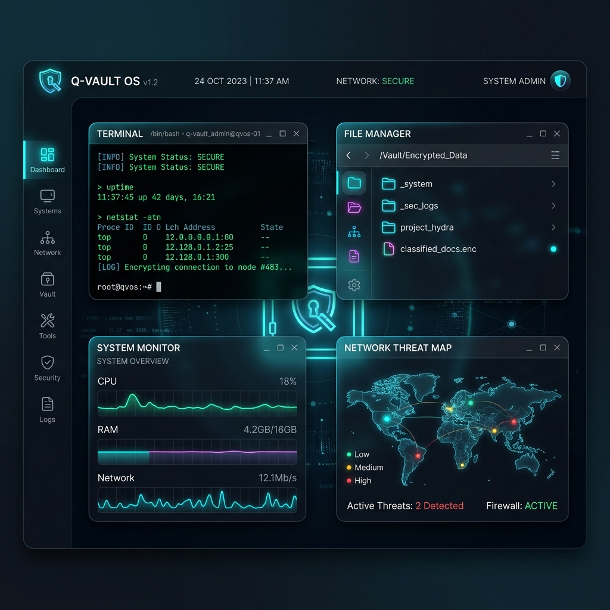

# 🛡️ Q-Vault OS: The Ultimate Secure AI-Native Simulator



## **Next-Generation Secure OS Simulation Environment**

*Fusing Python's agility with Rust's uncompromising safety.*


---

## 📖 Table of Contents

- [🌌 Overview](#overview)
- [🚀 Key Pillars of Excellence](#key-pillars-of-excellence)
- [🛠️ Technical Architecture](#technical-architecture)
- [📦 Included Subsystems](#included-subsystems)
- [🎨 Immersive Experience](#immersive-experience)
- [⚡ Quick Deployment](#quick-deployment)
- [🔒 Security Model](#security-model)
- [🤝 Contributing](#contributing)
- [📄 License](#license)

---

## 🌌 Overview {#overview}

**Q-Vault OS** is a high-fidelity **Operating System Simulation Framework** designed for researchers, security enthusiasts, and developers. It provides a hardened sandbox environment where every application, thread, and byte of data is governed by a dual-layered security architecture.

At its heart lies the **Q-Vault Security Core**, a native Rust implementation that handles the heavy lifting of cryptography and resource governance, while the **Fluid UI Layer** (PyQt5) delivers a premium, zero-latency desktop experience.

---

## 🚀 Key Pillars of Excellence {#key-pillars-of-excellence}

### 🦀 Rust-Hardened Kernel

Leveraging `PyO3`, the security-critical logic is offloaded to a native Rust binary.

- **Zero-Knowledge Architecture**: Encryption keys never touch the Python memory space.
- **AES-256-GCM Encryption**: Every file in the virtual filesystem is encrypted at rest.
- **Argon2id KDF**: Industrial-grade password hashing and key derivation.

### 🧠 AI-Native Governance

Q-Vault is built for the age of AI. The **Runtime Intelligence Manager** monitors application behavior in real-time.

- **Dynamic Trust Scores**: Apps are assigned trust levels based on their API call patterns.
- **Automated Quarantine**: Any anomalous behavior (e.g., unauthorized memory access) triggers an immediate system-level freeze.
- **Context-Aware Terminal**: A specialized shell that understands system state and provides AI-assisted command suggestions.

### 🖥️ Fluid Multitasking Engine

A custom-built window manager designed for maximum productivity.

- **Tiling & Snapping**: Intelligent window placement with physics-based animations.
- **Sub-Millisecond IPC**: Ultra-fast inter-process communication via an internal secure event bus.
- **Glassmorphic Aesthetics**: A modern, dark-themed UI with vibrant accents and smooth transitions.

---

## 🛠️ Technical Architecture {#technical-architecture}


---

## 📦 Included Subsystems {#included-subsystems}

| Subsystem | Description | Technology | Status |
| :--- | :--- | :--- | :--- |
| **Terminal** | POSIX-compliant shell with advanced nano & tab-completion. | Python + Rust | ✅ Stable |
| **File Manager** | Encrypted explorer with drag-and-drop support. | PyQt5 | ✅ Stable |
| **Notepad** | Professional GUI text editor with full file I/O. | PyQt5 | ✅ Stable |
| **System Monitor** | Live telemetry, resource graphs, and Trust Scores. | Matplotlib + IPC | ✅ Stable |
| **Security Hub** | RBAC policy management and audit log viewer. | Rust Core | 🛠️ In-Dev |
| **Browser** | Isolated web environment with restricted API access. | QtWebEngine | ✅ Stable |

---

## 🎨 Immersive Experience {#immersive-experience}

Q-Vault OS is designed with a **Cyber-Security Aesthetic** that balances form and function:

- **ASCII Boot Sequence**: A high-fidelity, gradient-colored boot banner that signals system readiness.
- **Dynamic Syntax Highlighting**: A custom-engineered terminal highlighter that provides real-time visual feedback.
- **Monospace Consistency**: Guaranteed alignment across all systems via an intelligent font-fallback engine.

---

## ⚡ Quick Deployment {#quick-deployment}

### Prerequisites

- **Python 3.10+**
- **Rust Toolchain** (latest stable)
- **.NET 9.0 Runtime** (Required for the Security Mediator)
- **Git**

### Installation

```bash
# Clone the repository
git clone https://github.com/zeyadmohamed2610/Q-VAULT-OS.git
cd Q-VAULT-OS

# Install dependencies and launch
# (The system will automatically build the Rust core on first run)
python run.py
```

---

## 🔒 Security Model {#security-model}

The simulation operates on the **Principle of Least Privilege (PoLP)**:

1. **Isolated Widgets**: Each application runs as an isolated proxy.
2. **Permissioned API**: No application can access the host filesystem without explicit tokens.
3. **Administrative Elevation**: The Security Mediator (`PQC-Vault`) may request UAC elevation to interface with kernel-level security features.
4. **Audit Logging**: Every system event is signed and stored in a secure ledger.

### 🔍 Troubleshooting & Diagnostics

If the security subsystem fails to initialize:

- Check the integration logs at `~/.qvault/logs/integration.log`.
- View the mediator's internal stderr/stdout at `~/.qvault/logs/mediator.log`.
- Ensure `PQC-Vault.exe` and its matching `PQC-Vault.dll` are present in the `binaries/` directory.

---

## 🤝 Contributing {#contributing}

We welcome contributions! Please see our [CONTRIBUTING.md](CONTRIBUTING.md) for details on our code of conduct and the process for submitting pull requests.

---

## 📄 License {#license}

This project is licensed under the MIT License - see the [LICENSE](LICENSE) file for details.

---

---
**Built with ❤️ by the Q-Vault Development Team**
*Protecting the simulation, one byte at a time.*


