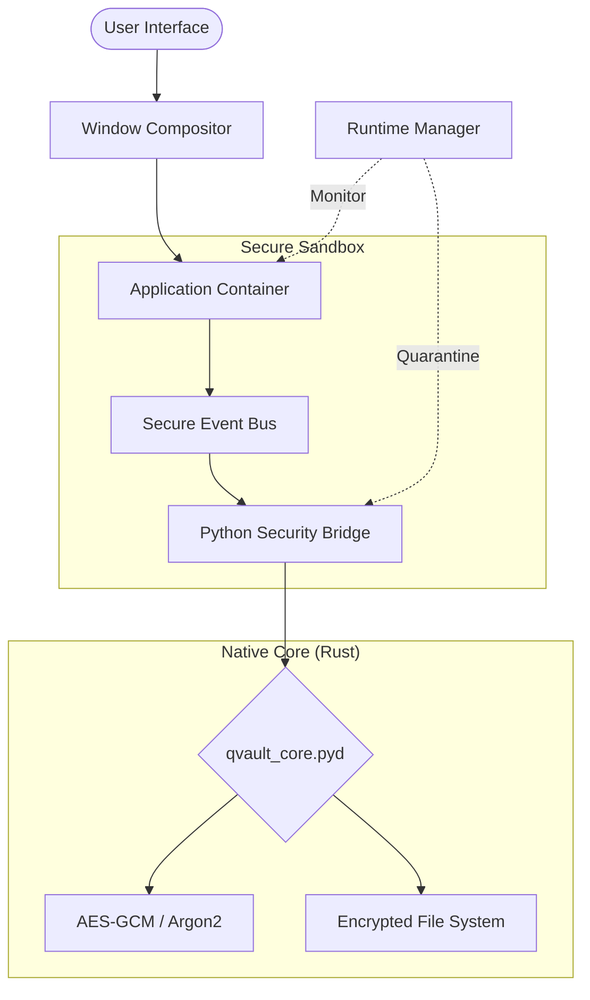

# 🛡️ Q-Vault OS: The Ultimate Secure AI-Native Simulator (v1.0.0)


## **Next-Generation Secure OS Simulation Environment**

*Fusing Python's agility with Rust's uncompromising safety. Stable Release v1.0.*


---

## 📖 Table of Contents

- [🌌 Overview](#overview)
- [🚀 Key Pillars of Excellence](#key-pillars-of-excellence)
- [🛠️ Technical Architecture](#technical-architecture)
- [📦 Included Subsystems](#included-subsystems)
- [🎨 Immersive Experience](#immersive-experience)
- [⚡ Quick Deployment](#quick-deployment)
- [🔒 Security Model](#security-model)
- [🛠️ Developer Guide](#developer-guide)
- [🤝 Contributing](#contributing)
- [📄 License](#license)

---

## 🌌 Overview {#overview}

**Q-Vault OS** is a high-fidelity **Operating System Simulation Framework** designed for researchers, security enthusiasts, and developers. v1.0 marks the transition to a fully hardened sandbox environment where every application, thread, and byte of data is governed by a dual-layered security architecture.

At its heart lies the **Q-Vault Security Core**, a native Rust implementation that handles the heavy lifting of cryptography and resource governance, while the **Fluid UI Layer** (PyQt5) delivers a premium, zero-latency desktop experience.

---

## 🚀 Key Pillars of Excellence {#key-pillars-of-excellence}

### 🦀 Rust-Hardened Kernel
Leveraging `PyO3`, the security-critical logic is offloaded to a native Rust binary.
- **Zero-Knowledge Architecture**: Encryption keys never touch the Python memory space.
- **AES-256-GCM Encryption**: Every file in the virtual filesystem is encrypted at rest.
- **Argon2id KDF**: Industrial-grade password hashing and key derivation.

### 🧠 AI-Native Governance
Q-Vault is built for the age of AI. The **Runtime Intelligence Manager** monitors application behavior in real-time.
- **Dynamic Trust Scores**: Apps are assigned trust levels based on their API call patterns.
- **Automated Quarantine**: Any anomalous behavior triggers an immediate system-level freeze.
- **Context-Aware Terminal**: A specialized shell with ghost-text suggestions and state-aware logic.

### 🖥️ Pro-Level UI/UX (New in v1.0)
- **Interactive Window Management**: Dynamic mouse cursors for resizing and snapping that feel native and responsive.
- **Native File Icons**: Professional-grade icon rendering using the host system's native icon provider for 100% clarity.
- **Administrative Elevation**: Seamless "Run as Administrator" context menus with secure password verification.
- **Glassmorphic Aesthetics**: Modern dark-mode UI with vibrant accents and smooth, hardware-accelerated transitions.

---

## 🛠️ Technical Architecture {#technical-architecture}



---

## 📦 Included Subsystems {#included-subsystems}

| Subsystem | Description | Technology | Status |
| :--- | :--- | :--- | :--- |
| **Terminal** | Pro-grade shell with ghost-text, redirection, and direct ROOT elevation support. | Python + Rust | ✅ v1.0 Stable |
| **File Manager** | Encrypted explorer with native OS icons and drag-and-drop. | PyQt5 | ✅ v1.0 Stable |
| **Notepad** | Professional GUI text editor with full file I/O. | PyQt5 | ✅ v1.0 Stable |
| **System Monitor** | Live telemetry, resource graphs, and Trust Scores. | Matplotlib + IPC | ✅ v1.0 Stable |
| **Security Hub** | RBAC policy management and audit log viewer. | Rust Core | 🛠️ In-Dev |
| **Browser** | Isolated web environment with restricted API access. | QtWebEngine | ✅ v1.0 Stable |

---

## 🎨 Immersive Experience {#immersive-experience}

Q-Vault OS is designed with a **Cyber-Security Aesthetic** that balances form and function:
- **ASCII Boot Sequence**: A high-fidelity, gradient-colored boot banner that signals system readiness.
- **Ghost-Text suggestions**: Intelligent command completion based on history and local filesystem context.
- **Dynamic Mouse Interaction**: Cursors update in real-time based on window zones (resize, drag, hover).
- **Monospace Consistency**: Guaranteed alignment across all systems via an intelligent font-fallback engine.

---

## ⚡ Quick Deployment {#quick-deployment}

### Prerequisites
- **Python 3.10+**
- **Rust Toolchain** (latest stable)
- **.NET 9.0 Runtime** (Required for the Security Mediator)
- **Git**

### Installation
```bash
# Clone the repository
git clone https://github.com/zeyadmohamed2610/Q-VAULT-OS.git
cd Q-VAULT-OS

# Install dependencies and launch
python run.py
```

---

## 🔒 Security Model {#security-model}

The simulation operates on the **Principle of Least Privilege (PoLP)**:
1. **Isolated Widgets**: Each application runs as an isolated proxy.
2. **Administrative Elevation**: Secure sudo-based elevation for privileged operations (Terminal, System Config).
3. **Permissioned API**: No application can access the host filesystem without explicit tokens.
4. **Audit Logging**: Every system event is signed and stored in a secure ledger.

---

## 🛠️ Developer Guide {#developer-guide}

### Project Structure
- **`kernel/`**: System orchestration and resource management.
- **`apps/`**: Source code for integrated subsystems (Terminal, Files, etc.).
- **`components/`**: UI building blocks (OSWindow, Desktop, Taskbar).
- **`system/`**: Core OS logic (AppFactory, WindowManager, SecurityAPI).
- **`assets/`**: Design tokens, themes, and icons.

---

## 📄 License {#license}

This project is licensed under the MIT License - see the [LICENSE](LICENSE) file for details.

---

**Built with ❤️ by the Q-Vault Development Team**
*Protecting the simulation, one byte at a time.*


