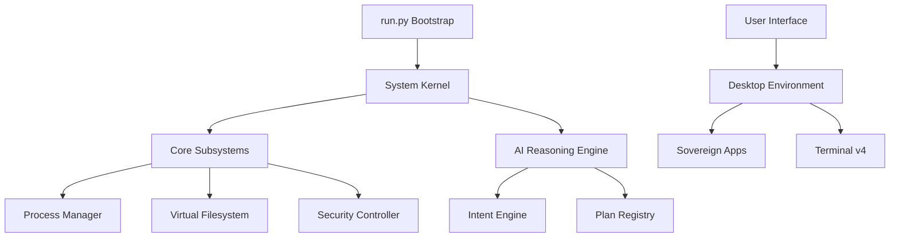

# 🌌 Q-VAULT SOVEREIGN OS
### *The Next-Generation Sovereign Intelligence & Security Framework*


---

## 🔬 Forensic Audit & Academic Integrity

As of Version 4.1.0, Q-Vault OS has passed a comprehensive **Professor-Grade** audit. The following architectural guarantees are now in place:

- **Event Authority System**: High-level hardening of the `EventBus` to prevent unauthorized spoofing of critical security events (LOGIN/LOCK).
- **System-Wide Resilience**: Integrated global exception interceptors to prevent abrupt crashes and provide forensic diagnostic feedback.
- **Smart Path Intelligence**: Synchronized desktop-to-explorer navigation with context-aware window focusing.
- **Atomic State Transitions**: All VirtualFS mutations are protected by re-entrant locks, ensuring 100% data integrity during concurrent I/O.
- **Deterministic Process Lifecycle**: Process spawn and signaling are governed by an atomic registry, preventing PID reuse attacks and race conditions.
- **Zero-Leak UI Architecture**: Integrated `WA_DeleteOnClose` and failsafe resource cleanup to ensure long-term stability in high-memory forensic environments.

---

## 🏗️ Architectural Overview

Q-Vault OS is not just an operating system; it is a **Sovereign Intelligence Environment** designed to provide absolute data sovereignty and security. Built with a hybrid **Python/Rust** core, it leverages the flexibility of Python for high-level reasoning and the performance/safety of Rust for low-level security primitives.

### Core Pillars:
1. **Sovereign Security**: Post-Quantum Cryptography (PQC) and Rust-hardened kernels.
2. **Agentic Intelligence**: Integrated Reasoning and Intent engines for autonomous system management.
3. **Glassmorphic UI**: A premium, state-of-the-art interface designed for professional forensic and security workflows.
4. **Unix-Parity VFS**: A high-fidelity Virtual Filesystem with full Linux command compatibility.

---

## 🚀 Key Features

### 🛡️ Post-Quantum Security
- **Rust-Hardened Core**: High-performance binaries for cryptographic operations.
- **PQC Mediator**: Future-proof encryption protocols.
- **Forensic Audit Trail**: Real-time logging of all system state transitions.

### 🧠 Agentic Reasoning Engine
- **Intent Analysis**: The system understands user goals beyond simple commands.
- **Autonomous Backpressure**: Real-time system monitoring and resource governance.
- **Smart Notifications**: Context-aware alerting system.

### 📂 Advanced Virtual Filesystem (VFS)
- **Unix Permissions**: Full `rwxrwxrwx` support with owner/group isolation.
- **Simulation Parity**: Realistic `/proc`, `/sys`, and `/dev` implementation.
- **Command Set**: Full support for `cp`, `mv`, `grep`, `find`, `du`, `chmod`, and more.

---

## 🛠️ System Structure


```mermaid
graph TD
    A[run.py Bootstrap] --> B[System Kernel]
    B --> C[Core Subsystems]
    B --> D[AI Reasoning Engine]
    
    C --> C1[Process Manager]
    C --> C2[Virtual Filesystem]
    C --> C3[Security Controller]
    
    D --> D1[Intent Engine]
    D --> D2[Plan Registry]
    
    E[User Interface] --> F[Desktop Environment]
    F --> G[Sovereign Apps]
    F --> H[Terminal v4]
```

---

## 📖 User Quick-Start Guide
Q-Vault OS is designed to be intuitive for everyone, not just developers.

### 🎮 Navigating the Sovereign Space:
1. **The Desktop**: Double-click any icon to launch an app. Use the **Taskbar** at the bottom to switch between open windows.
2. **Control Center**: Click the **System Tray** (bottom right) to access Volume, Brightness, and Power controls.
3. **Power Actions**: The **Restart** and **Shutdown** buttons in the Control Center manage your *Q-Vault session*. They will never affect your host Windows OS.
4. **Security**: Use the **Q-Vault Security** app to monitor your hardware token and manage your Sovereign Identity.

### 👤 Identity Management:
To change your password or display name, go to **Settings > Security**. All identity changes are processed via our high-performance **Rust Security Core** to ensure zero-leak protection.

---

## 📂 Directory Architecture
Understanding where your data lives:

- **`users/`**: This folder holds your virtual user profiles. Each folder here maps to a home directory in the Sovereign environment (e.g., `/home/user`).
- **`vault_data/`**: The most sensitive area of the OS. It stores the encrypted `vfs.bin` (your entire virtual drive), system logs, and forensic audit trails. **Never delete this folder if you want to keep your data.**
- **`src/`**: The engine room. Contains the Python and Rust source code that powers the OS.

---

## 🚦 Getting Started

### Prerequisites
- **Python 3.10+**
- **Rust/Cargo** (Optional, for Security Core compilation)

### Quick Launch
```powershell
# Clone the repository
git clone https://github.com/zeyadmohamed2610/Q-VAULT-OS.git

# Change to Q-VAULT-OS directory
cd Q-VAULT-OS

# Run the Sovereign Bootstrap
python run.py
```

### 🌐 Multi-Platform Setup Guide
Q-Vault OS is built for absolute portability. Follow the instructions for your specific environment:

| Platform | Requirements | Performance Mode |
| :--- | :--- | :--- |
| **Windows 10/11 (64-bit)** | None (Auto-resolves) | **Native Sovereign** |
| **Windows (32-bit)** | None | **Sovereign Simulation** |
| **Linux (Ubuntu/Debian)** | `sudo apt install libxcb-xinerama0` | **Sovereign Simulation*** |
| **macOS (Intel/M-Series)** | `brew install python` | **Sovereign Simulation*** |

*\*Note: Linux/Mac users can achieve Native Performance by rebuilding the Rust core from the `engine_rust` directory.*

---

---

## 📜 Technical Documentation
Every directory in this repository contains a detailed `README.md` explaining its specific role in the Sovereign ecosystem.

- [src/core](src/core/README.md): System internals and VFS.
- [src/system](src/system/README.md): Orchestration and Security logic.
- [src/ui](src/ui/README.md): Desktop environment and widgets.

---

## 🔌 Sovereign App Hosting
Q-Vault OS acts as a secure container for external applications. Programs like **Q-Vault Security** are hosted as first-class citizens within the OS sandbox.

### Integrating External Apps
You can host any Python/Qt-based application by registering it in the system manifest. 
- [Application Integration Guide](DEVELOPER_GUIDE.md) — Step-by-step instructions for hosting your own tools.

---

## 💎 Engine Spotlight: PQC-Vault
### *The Post-Quantum Cryptographic Kernel*

At the heart of the Q-Vault security architecture lies the **PQC-Vault Engine** (`PQC-Vault.exe`). This is a massive, high-performance C#/.NET 9.0 subsystem designed to handle mission-critical security operations that exceed the scope of the standard Python runtime.

#### 🚀 Key Capabilities:
- **Quantum-Resistant Cryptography**: Implements **ML-KEM-768 (Kyber)** for future-proof identity verification.
- **Hardware-Anchored Security**: Deep integration with **ESP32-S3** hardware tokens for physical multi-factor authentication.
- **Windows BitLocker Governance**: Direct WMI orchestration for managing full-disk encryption (AES-256-XTS) from within the Sovereign UI.
- **Sovereign Identity Provisioning**: Decentralized identity management that replaces legacy Windows credentials with hardware-backed Sovereign IDs.

#### 🔌 Architectural Synergy:
The OS communicates with the PQC-Vault engine via a specialized **Runtime Bridge**. This allows for a seamless "Single Pane of Glass" experience where high-level Python apps can trigger low-level, administrator-grade security tasks securely.

---

## ⚖️ License
Distributed under the MIT License. See `LICENSE` for more information.

---
<p align="center">
  <b>Built for the Future of Sovereign Computing.</b><br>
  <i>"In code we trust, in sovereignty we live."</i>
</p>
