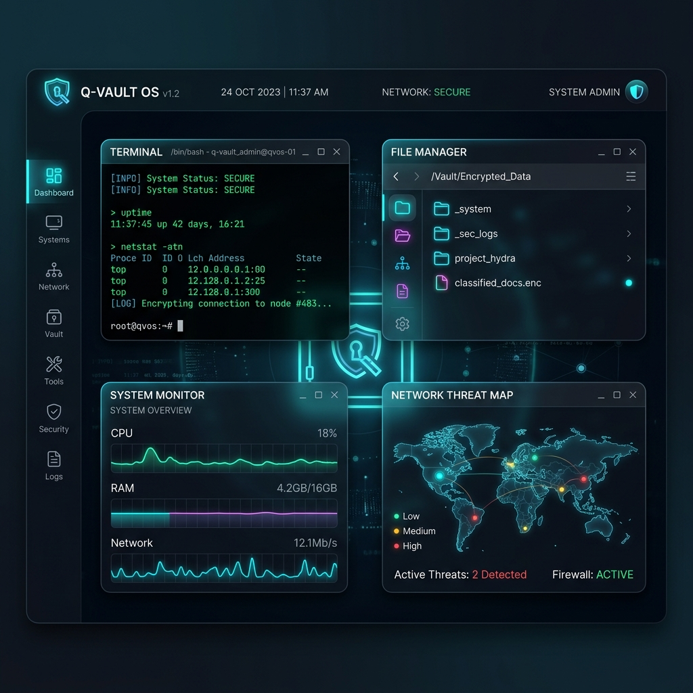
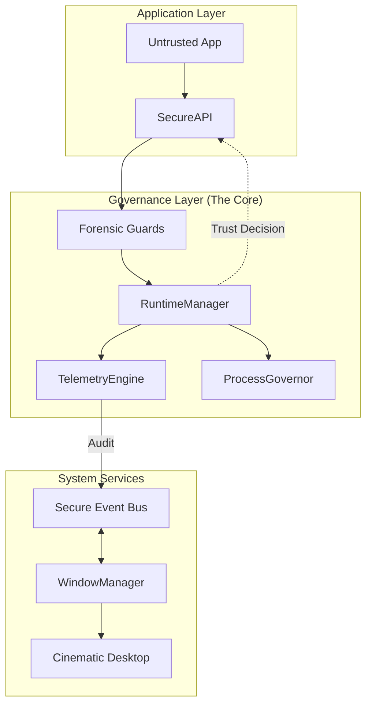

# 🛡️ Q-Vault OS: Governed Secure Runtime Environment (v1.0.0-Hardened)



## **The Sovereign Research-Grade Runtime**

*A zero-trust execution environment focused on isolation, telemetry, and behavioral governance. Stable Release v1.0.*


---

## 📖 Table of Contents

- [🌌 Overview](#overview)
- [📚 Forensic Documentation (Deep Dive)](#forensic-documentation)
- [🚀 Key Pillars of Excellence](#key-pillars-of-excellence)
- [🛠️ Technical Architecture](#technical-architecture)
- [📦 Included Subsystems](#included-subsystems)
- [🔒 Security & Governance Model](#security-model)
- [⚡ Quick Deployment](#quick-deployment)
- [🤝 Contributing](#contributing)
- [📄 License](#license)

---

## 🌌 Overview {#overview}

**Q-Vault OS** is not a general-purpose operating system, but a **Governed Secure Runtime Environment**. It is designed as a research platform to demonstrate advanced concepts in **Behavioral Security**, **Mandatory Mediation**, and **Runtime Explainability**.

Built on a decoupled Micro-Kernel architecture, Q-Vault mediates every application execution path through a centralized security gateway, ensuring that untrusted code remains isolated while providing forensic-grade telemetry to the kernel.

---

## 📚 Forensic Documentation (Deep Dive) {#forensic-documentation}

For a deep technical audit of the system's "Engineering Thought Process," refer to the following forensic reports:

*   **[Architecture Master Map](docs/subsystems_deep_dive/ARCHITECTURE_MASTER_MAP.md)**: The full topology and execution blueprints.
*   **[Boot & UI Governance](docs/subsystems_deep_dive/BOOT_AND_UI.md)**: Secure initialization and window isolation.
*   **[Trust & Quarantine](docs/subsystems_deep_dive/GOVERNANCE_AND_TRUST.md)**: The behavioral scoring and isolation pipeline.
*   **[Security & IPC](docs/subsystems_deep_dive/SECURITY_AND_IPC.md)**: Event bus internals and sandbox enforcement.
*   **[Metrics & Policy](docs/subsystems_deep_dive/METRICS_AND_POLICY.md)**: Telemetry engine and adaptive governance states.

---

## 🚀 Key Pillars of Excellence {#key-pillars-of-excellence}

### 🧠 Behavioral Governance (Trust Scoring)
Unlike static permission models, Q-Vault uses a dynamic **Trust Algorithm**. Applications gain or lose access based on their real-time resource usage, error rates, and API call patterns.

### 🛡️ Mandatory Mediation (SecureAPI)
No application has direct access to OS primitives. Every filesystem, process, or network request is routed through a **Forensic Security Gateway** that performs stack-frame integrity checks to prevent context-escape.

### 🔍 Runtime Explainability
Q-Vault doesn't just block; it explains. The **Explainability Layer** provides a complete `Governance Trace`, allowing users to audit why a specific application was throttled or quarantined.

### 🎭 Cinematic Identity (Sovereign Masking)
The **Process Governor** ensures a completely immersive experience by masking host OS artifacts. Process names and file paths are aliased to represent the Q-Vault sovereign identity.

---

## 🛠️ Technical Architecture {#technical-architecture}


```mermaid
graph TD
    subgraph "Application Layer"
        App[Untrusted App] --> SA[SecureAPI]
    end

    subgraph "Governance Layer (The Core)"
        SA --> Guard[Forensic Guards]
        Guard --> RM[RuntimeManager]
        RM --> TM[TelemetryEngine]
        RM --> PG[ProcessGovernor]
    end

    subgraph "System Services"
        EB[Secure Event Bus] <--> WM[WindowManager]
        WM --> UI[Cinematic Desktop]
    end

    RM -.-> |Trust Decision| SA
    TM --> |Audit| EB
```

---

## 📦 Included Subsystems {#included-subsystems}

| Subsystem | Description | Technology | Status |
| :--- | :--- | :--- | :--- |
| **Terminal** | Pro-grade governed shell with forensic auditing and root elevation. | Python | ✅ v1.0 Stable |
| **Runtime Inspector**| Real-time explainability tool for governance decision traces. | Forensic API | ✅ v1.0 Stable |
| **File Manager** | Encrypted explorer with virtual path mapping and isolation. | PyQt5 | ✅ v1.0 Stable |
| **System Monitor** | Live telemetry, resource pressure graphs, and trust scoring. | Matplotlib | ✅ v1.0 Stable |
| **Security Hub** | RBAC policy enforcement and quarantine management. | Governed Core| ✅ v1.0 Stable |

---

## 🔒 Security & Governance Model {#security-model}

Q-Vault operates on a **Zero-Trust** architectural model:

1.  **Mandatory Access Control (MAC)**: All resource requests are validated against central policies.
2.  **Backpressure Enforcement**: The system automatically throttles apps during high resource pressure.
3.  **Stack-Trace Interdiction**: Subprocess calls are intercepted via stack analysis to prevent bypass.
4.  **Identity Isolation**: Every instance runs in a uniquely keyed cryptographic context.

---

## ⚡ Quick Deployment {#quick-deployment}

### Prerequisites

- **Python 3.10+**
- **PyQt5** (`pip install PyQt5`)
- **Psutil** (`pip install psutil`)
- **Matplotlib** (`pip install matplotlib`)

### Installation

```bash
# Clone the repository
git clone https://github.com/zeyadmohamed2610/Q-VAULT-OS.git
cd Q-VAULT-OS

# Launch the Governed Runtime
python run.py
```

---

## 🤝 Contributing

We welcome contributions focused on system governance, sandbox techniques, and forensic visualization.

1. Fork the repository.
2. Create a feature branch (`git checkout -b feature/AmazingFeature`).
3. Commit your changes (`git commit -m 'Add some AmazingFeature'`).
4. Push to the branch (`git push origin feature/AmazingFeature`).
5. Open a Pull Request.

---

## 📄 License

This project is licensed under the MIT License - see the [LICENSE](LICENSE) file for details.

---

**Built with ❤️ by the Q-Vault Development Team**
*Protecting the simulation, one byte at a time.*


