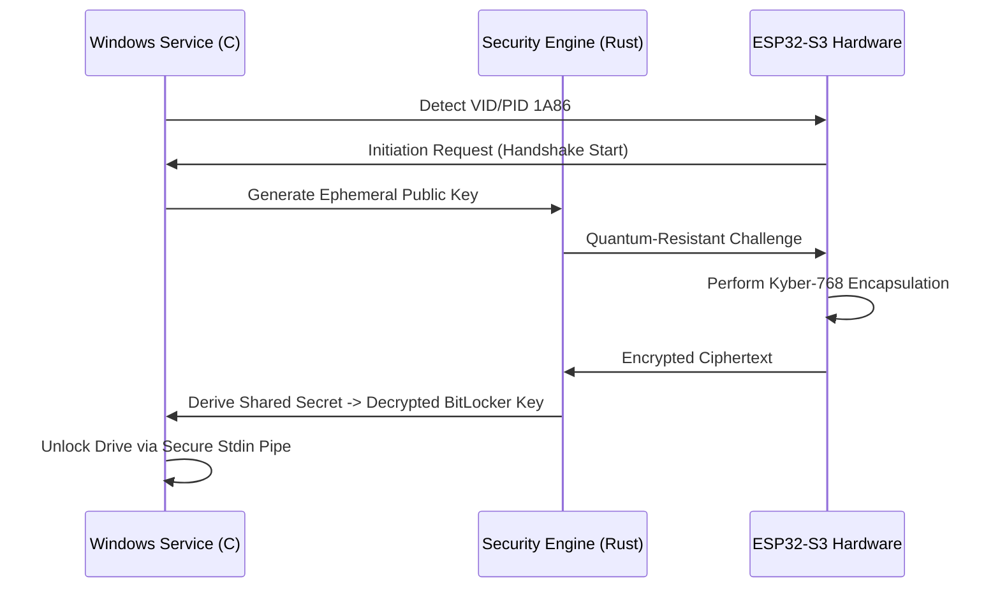

# 🛡️ التقرير الفني الاستراتيجي المتكامل: مشروع Q-VAULT
## منظومة الأمان السيبراني المتقدمة لما بعد الكم (Post-Quantum Security Ecosystem)

---

## ١. ملخص الفكرة والابتكار (The Concept)

### **بيان المشكلة (Deep Tech Problem Statement):**
نحن نقف على أعتاب ثورة الحوسبة الكمومية، وهي الثورة التي ستحول أقوى أنظمة التشفير الحالية (مثل RSA و ECC) إلى أنظمة هشة يمكن كسرها في دقائق. المشكلة الأساسية هي أن بياناتنا المشفرة اليوم يتم جمعها وتخزينها من قبل جهات معادية بانتظار نضوج هذه الحاسبات لفك تشفيرها مستقبلاً (هجوم Harvest Now, Decrypt Later). بالإضافة إلى ذلك، تعتمد حلول مثل BitLocker على ذاكرة النظام (RAM) لتخزين مفاتيح فك التشفير، مما يفتح الباب لهجمات الاستخراج البرمجي والفيزيائي.

### **الفكرة المبتكرة (Innovation):**
Q-VAULT ليس مجرد سوفتوير، بل هو نظام بيئي "هجين" يربط بين العتاد الصلب (Hardware) وبروتوكولات تشفير ما بعد الكم. يبتكر النظام حلاً يعتمد على "المصداقية المادية"؛ حيث لا يمكن لخدمة الويندوز فك تشفير القرص إلا من خلال مصافحة رياضية (Handshake) معقدة تتم داخل شريحة ESP32-S3 المادية باستخدام خوارزمية **Kyber-768**.

### **القيمة المضافة:**
1. **أمان مستقبلي:** حماية البيانات ضد هجمات الحاسبات الكمومية.
2. **ارتباط مادي (Hardware Bound):** منع فك التشفير في حالة سرقة الجهاز بدون القطعة المادية.
3. **انعدام المعرفة (Zero-Knowledge):** لا يتم إرسال مفتاح التشفير الأصلي أبداً عبر كابل الـ USB، بل يتم إرسال ناتج عملية التشفير فقط.

---

## ٢. الدراسة الفنية والهندسية (Technical Design)

### **مكونات الفكرة (Technical Components):**
*   **Hardware Layer (ESP32-S3):** معالج دقيق مؤمن يعمل كـ "صندوق أسود" يحتوي على نظام تشغيل مصغر (Firmware) لإدارة المفاتيح وتنفيذ خوارزميات الـ PQC.
*   **Security Core (Rust):** نواة أمنية مكتوبة بلغة Rust لضمان أمان الذاكرة (Memory Safety) ومنع ثغرات Buffer Overflow، وهي المسؤولة عن منطق المصافحة.
*   **OS Mediator (C#/.NET):** وسيط برمجي يتفاعل مع Windows API و WMI لإدارة حالات الأقراص الصلبة وإصدار أوامر فك التشفير البرمجية.
*   **Fluid UI (Python/Rust):** واجهة مستخدم متطورة مبنية بأسلوب الـ Glassmorphism لتقديم تجربة مستخدم سلسة وأمنة.

### **آلية العمل (Technical Workflow):**


### **مقومات النجاح التقنية:**
* **تكنولوجيا Kyber-768:** المعيار الذهبي المعتمد من NIST.
* **AES-256-GCM:** لضمان سلامة وسرية البيانات المنتقلة عبر الـ USB.
* **الاستدامة:** هيكلية Modular تسمح بتحديث خوارزميات التشفير دون تغيير الهاردوير.

---

## ٣. خطة التصنيع والإنتاج (Manufacturing Plan)

### **مصادر الخامات ومراحل الإنتاج:**
*   **المواد الأولية:** شرائح ESP32-S3 من شركة Espressif، لوحات PCB بـ 4 طبقات، وموصلات USB-C عالية الجودة.
*   **مراحل الإنتاج:**
    1.  **تصميم الـ PCB:** هندسة الدوائر لتقليل الضوضاء الكهرومغناطيسية.
    2.  **SMT Assembly:** تركيب المكونات بدقة آلية.
    3.  **Firmware Injection:** حقن السوفتوير وإغلاق منافذ البرمجة (JTAG Fuse) للأمان.
    4.  **Anti-Tamper Packaging:** تغليف القطعة بمواد كيميائية تمنع الفحص الفيزيائي للمكونات.

### **النماذج الأولية (Prototyping):**
تم بناء النماذج الأولية باستخدام تقنيات الطباعة ثلاثية الأبعاد SLA لتجربة الأغلفة وتبريد الشريحة، واستخدام بيئة ESP-IDF للاختبارات البرمجية المكثفة.

---

## ٤. دراسة السوق والتسويق (Marketing Strategy)

### **الفئة المستهدفة وتحليل المنافسين:**
*   **المستهدفون:** القطاعات العسكرية، البنوك، مكاتب المحاماة، ومستثمرو العملات الرقمية.
*   **المنافسون:** Yubico و Nitrokey. يتفوق Q-VAULT بتقديم أمان "ما بعد الكم" وتكامل مباشر مع "BitLocker" لا توفره الحلول الحالية بنفس السلاسة.
*   **المزيج التسويقي:**
    *   **المنتج:** مفتاح أمان مادي + سوفتوير إدارة.
    *   **السعر:** استراتيجية Premium لاستهداف القطاعات عالية الحساسية.
    *   **الترويج:** المشاركة في مؤتمرات الأمن السيبراني وعروض حية لعمليات الاختراق وكيف يمنعها Q-VAULT.

### **نموذج العمل (Business Model Canvas):**
*   **القيم المقدمة:** حماية مطلقة ضد تهديدات المستقبل.
*   **العلاقات مع العملاء:** دعم فني متخصص وتحديثات أمنية دورية.
*   **مصادر الإيرادات:** بيع الهاردوير + تراخيص SaaS للمؤسسات.

---

## ٥. دراسة الجدوى الاقتصادية (Economic Feasibility)

### **التحليل المالي:**
*   **التكاليف الاستثمارية:** تشمل تكاليف الـ R&D، قوالب حقن البلاستيك، واختبارات الاختراق الخارجية (Pen-testing).
*   **نقطة التعادل:** من المتوقع الوصول لها بعد بيع 500 وحدة بفضل هامش الربح المرتفع في قطاع الأمن السيبراني.
*   **التمويل:** استهداف مستثمري الـ Deep Tech وجولات التمويل الأولي (Seed Funding).

---

## ٦. الاستدامة والأثر (Impact & Sustainability)

### **الأثر البيئي والمجتمعي:**
*   **الاستدامة:** المفتاح مصمم ليدوم أكثر من عقد من الزمن مع إمكانية تحديث البرامج داخلياً (OTA).
*   **الأثر:** حماية الخصوصية الرقمية للمجتمع ككل ومنع الانهيارات الأمنية التي قد تنتج عن تطور الحاسبات الكمية، مما يدعم الهدف 9 من أهداف التنمية المستدامة (SDGs).

---

## ٧. الملكية الفكرية (Intellectual Property)

### **استراتيجية الحماية:**
*   **براءات الاختراع:** تسجيل الطريقة المبتكرة للربط بين بروتوكول Kyber و BitLocker API.
*   **العلامة التجارية:** تسجيل "Q-VAULT" كعلامة تجارية دولية.
*   **حقوق النشر:** الكود المصدري محمي بحقوق ملكية فكرية مع توفير أجزاء منه للتدقيق الأمني (Public Audit).

---

## ٨. دعم VeraCrypt المتقدم (Advanced VeraCrypt Integration)

### **لماذا VeraCrypt؟**
بينما يعتمد BitLocker على بيئة Windows المغلقة المصدر، فإن VeraCrypt يوفر مزايا أمنية متقدمة:

1. **الإنكار المنطقي (Plausible Deniability):**
   *   القدرة على إنشاء "خزانات مخفية" داخل الخزنة العادية
   *   عدم القدرة على إثبات وجود الخزنة المخفية رياضياً
   *   حماية من الضغوط لإعطاء كلمة المرور

2. **الاستقلالية والشفافية:**
   *   نظام مفتوح المصدر تم تدقيقه أمنياً عدة مرات
   *   لا توجد "Backdoors" حكومية محتملة

3. **التشفير المتداخل (Cascaded Encryption):**
   *   إمكانية دمج 3 خوارزميات تشفير: **AES + Twofish + Serpent**
   *   تشفير متعدد الطبقات يجعل كسره شبه مستحيلاً

4. **الدعم متعدد المنصات:**
   *   يفتح الباب لاستخدام Q-Vault على Linux و macOS

### **التكامل العملي:**
*   **دمج DLL مباشر:** سيتم دمج مكتبة VeraCrypt DLL مباشرة للاتصال الفوري
*   **واجهة Programmatic API:** للتحكم البرمجي في عمليات التشفير
*   **دعم خزنتين:** BitLocker (Windows) + VeraCrypt (Cross-platform)

### **التشفير المتعدد الطبقات (Triple-Layed Encryption):**
```
Layer 1: AES-256 (الخوارزمية القياسية العالمية)
    ↓
Layer 2: Twofish (مقاومة عالية ضد التحليل الإحصائي)
    ↓
Layer 3: Serpent (أعلى مستويات الأمان حتى لوقت طويل)
```
كل طبقة مستقلة ولا يمكن اختراق أي منها إلا بالتباطؤ (Cascade Attack Resistance).

---

**تم إعداد هذا المستند ليكون المرجع التقني الشامل لمشروع Q-VAULT.**
