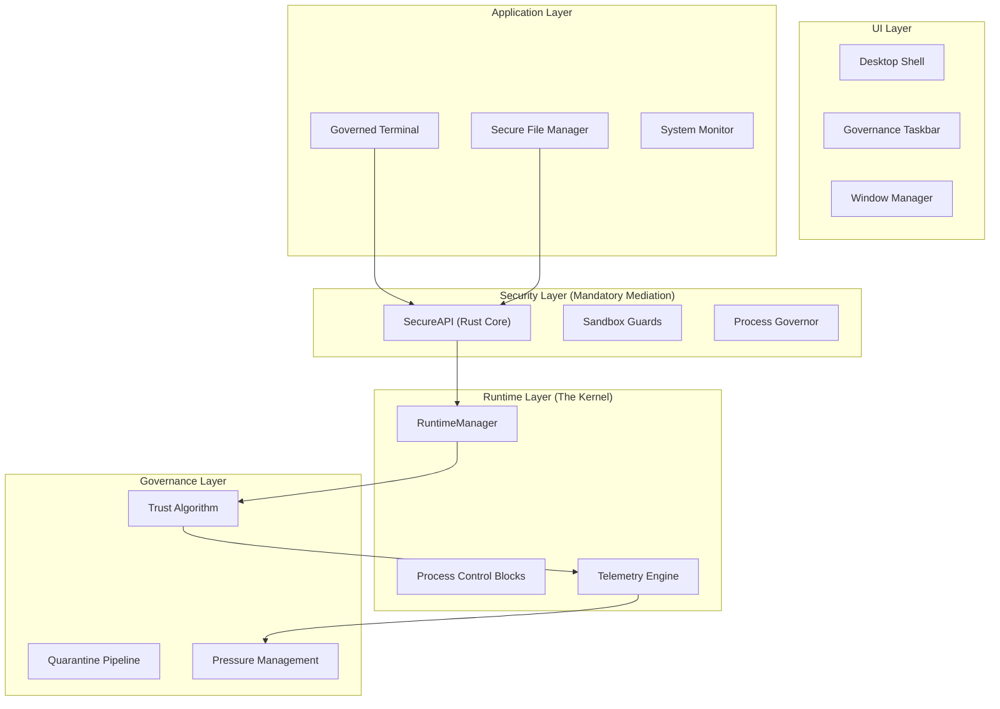

# Q-Vault OS: Technical Specification & Architectural Research
## A Governed Secure Runtime Environment

**Date:** May 11, 2026  
**Classification:** Research Prototype (Academic Graduation Project)  
**Institution:** Helwan International Technological University  
**Department:** Cybersecurity  

---

## 1. Executive Summary

**Q-Vault OS** is a "Governed Secure Runtime Environment" designed to explore the intersection of **Behavioral Trust Scoring** and **Mandatory Mediation** in user-space application management. Built using Python 3.11 and the PyQt5 framework, Q-Vault simulates a sovereign runtime that governs untrusted applications through continuous telemetry monitoring and a zero-trust execution pipeline.

Unlike traditional operating systems that rely on static permission manifests, Q-Vault implements a dynamic **Runtime Governance Layer** that throttles or quarantines applications based on real-time behavior, such as API call frequency, CPU pressure, and memory volatility. This project serves as a research prototype for future secure runtimes where application trust is earned, not just declared.

---

## 2. Research Motivation

Modern application security often fails at the "Time-of-Check to Time-of-Use" (TOCTOU) boundary. Once an application is granted permission, it is rarely monitored for behavioral drift. Q-Vault addresses this by:
1.  **Eliminating Implicit Trust:** Every application starts with a baseline trust score that must be maintained through compliant behavior.
2.  **Continuous Telemetry:** Monitoring the "pulse" of the application (IPC latency, memory spikes) to detect anomalies.
3.  **Mandatory Mediation:** Enforcing a strict `SecureAPI` gateway that prevents direct access to host OS resources.

---

## 3. System Vision & Philosophy

> "Every application is untrusted by default and must continuously earn execution trust through monitored behavior."

Q-Vault is built on the philosophy of **Sovereign Application Governance**. It treats the host Operating System (Windows/Linux) merely as a "hardware abstraction layer" while the Q-Vault Runtime provides the true security boundary.

---

## 4. High-Level Architecture

Q-Vault follows a mediated micro-kernel inspired architecture, layered for maximum isolation:

---

## 5. Subsystem Engineering Specifications

### 5.1 RuntimeManager (The Authority)
The `RuntimeManager` is the central authority of the system. It tracks every running instance and maintains their state in an `AppRecord`.

*   **Trust Score (0-100):** A dynamic integer representing the current trustworthiness of an instance.
*   **Earned Recovery:** Applications gain +1 trust point for every 60 seconds of stable behavior (low resource usage and zero warnings).
*   **System Pressure Sensing:** Aggregates global CPU usage, UI lag (heartbeat latency), and API call bursts to transition between system states.

### 5.2 Governance States
The system dynamically adjusts resource allocation based on aggregate load and individual trust:

| State | Trigger | Action |
| :--- | :--- | :--- |
| **NORMAL** | Pressure < 0.7 | 10 Worker slots per app. |
| **SOFT** | Pressure > 0.7 | 7 Worker slots per app. |
| **AGGRESSIVE**| Pressure > 1.0 | 5 Worker slots per app. |
| **EMERGENCY** | Pressure > 1.3 | 3 Worker slots; Global Throttling. |

### 5.3 SecureAPI & Sandbox Architecture
Applications are strictly forbidden from importing `os`, `subprocess`, or `pathlib` directly. All resource requests pass through the **SecureAPI**.

*   **Virtual File System (VFS):** Paths are remapped from host locations (e.g., `C:\Users\Name\.qvault`) to virtual locations (e.g., `/secure/storage`).
*   **Stack-Frame Verification:** The API inspects the calling stack to ensure the request originated from a valid app worker, preventing code injection or unauthorized imports.
*   **Logical Isolation:** Each application is jailed within a unique instance directory in the `users/` folder.

### 5.4 ProcessGovernor (Identity Masking)
To achieve "Sovereign Identity," the `ProcessGovernor` masks host OS artifacts during execution and in telemetry logs.

*   **Process Aliasing:** `chrome.exe` → `vault-browser`, `svchost.exe` → `governor.service`.
*   **Path Sanitization:** Automatically removes drive letters and Windows-specific folder names (AppData, LocalSettings) from all terminal outputs.
*   **Documentary Safe Mode:** Stabilizes telemetry values (CPU/Memory) to predefined "healthy" constants for professional cinematic presentation.

---

## 6. Execution Flow: The Quarantine Pipeline

When an application's Trust Score falls below **20**, the `RuntimeManager` initiates the Quarantine Sequence:

1.  **API Lock:** The instance's `SecureAPI` token is invalidated. All future syscalls return `Access Denied`.
2.  **Execution Throttling:** All active worker threads for the instance are paused or killed.
3.  **Visual Overlay:** A "Quarantine Warning" is rendered over the application window.
4.  **Forensic Preservation:** The application state is frozen for administrative review instead of being immediately terminated.

---

## 7. Telemetry Engine & EventBus

The **EventBus** acts as the central nervous system, using a thread-safe **Publish/Subscribe** pattern.

*   **Telemetry Threads:** Continuously poll memory RSS, CPU cycles, and IPC latency.
*   **Heartbeat Monitor:** Detects UI thread lag. If lag exceeds 800ms, the system enters **EMERGENCY** state to prevent deadlock.
*   **Forensic Audit Trail:** All events (crashes, violations, penalties) are serialized into a rotating `audit_trail.ndjson` for post-mortem analysis.

---

## 8. Threading & Performance Model

Q-Vault utilizes a multi-threaded architecture to maintain UI responsiveness:
*   **Main Thread:** Dedicated exclusively to the PyQt5 Event Loop and UI rendering.
*   **App Worker Threads:** Each application runs its logic in background workers to prevent UI freezing.
*   **Governor Threads:** Independent monitors for pressure sensing and deadlock detection.

**Constraint Note:** Due to the Python Global Interpreter Lock (GIL), true multicore scaling is limited. The system compensates using the `AdaptiveScheduler` to distribute time-slices efficiently.

---

## 9. Threat Model

### 9.1 Defended Vectors
*   **Rogue Applications:** Behavioral analysis catches apps attempting to spam the system or leak data.
*   **Path Traversal:** VFS and path sanitization prevent apps from escaping their `/secure` jail.
*   **Resource Starvation:** The Governance Layer prevents a single app from consuming 100% of CPU/Workers.
*   **UI Spoofing:** Centralized window management prevents apps from rendering outside their assigned boundaries.

### 9.2 Known Limitations
*   **User-Space Only:** Does not defend against Ring 0 / Kernel exploits.
*   **Logical Isolation:** Sandboxing is logical (mediated APIs) and does not use OS-level cgroups or Docker-style namespaces.
*   **Simulation:** Hardware security tokens (Kyber/PQC) are simulated for research demonstration.

---

## 10. Team & Administration

**Supervisor:** Dr. Abeer Hassan El-Bakly  
**Teaching Assistants:** Karim Adel, Mohamed Hamdy  

**Student Research Team:**
1. جني محمد مختار محمد
2. مريم احمد محمد عبد التواب
3. نور عبد الناصر محمود عبد العاطي
4. فاطمه سيد حسن محمود
5. يارا عادل احمد بكري
6. ملك عنتر رمضان محمود
7. ابراهيم ياسر احمد عبدالهادي
8. روضه ناصر رشاد
9. حبيبه احمد محمد السعيد الشركسي
10. عمر محمد رأف علي عمر
11. عبدالله صلاح احمد محمد محمد
12. ريتاج الامير احمد محمد
13. احمد عبدالغني احمد عبدالله
14. حبيبه حسين كامل عبد اللطيف
15. مارسيل عادل زكي كامل
16. بسام حسام عيد مصطفى
17. زياد محمد السيد محمد السيد

---

## 11. Conclusion

Q-Vault OS demonstrates that dynamic, behavior-driven governance is a viable model for securing application runtimes. By shifting the focus from "what an app is allowed to do" to "how an app is behaving," Q-Vault provides a resilient environment capable of mitigating both known and unknown behavioral threats.

---

## 12. References
1.  *Saltzer, J. H., & Schroeder, M. D. (1975). The Protection of Information in Computer Systems.*
2.  *Zero Trust Architecture (NIST SP 800-207).*
3.  *The Principle of Least Privilege (PoLP) in Secure System Design.*
4.  *Behavioral Analysis in Intrusion Detection Systems (IDS).*
