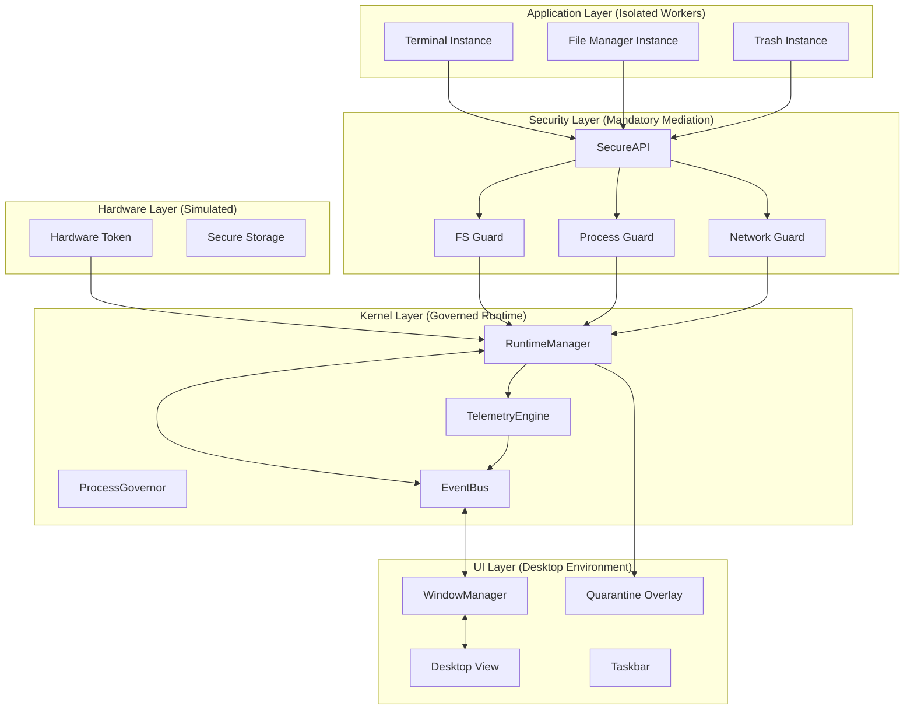
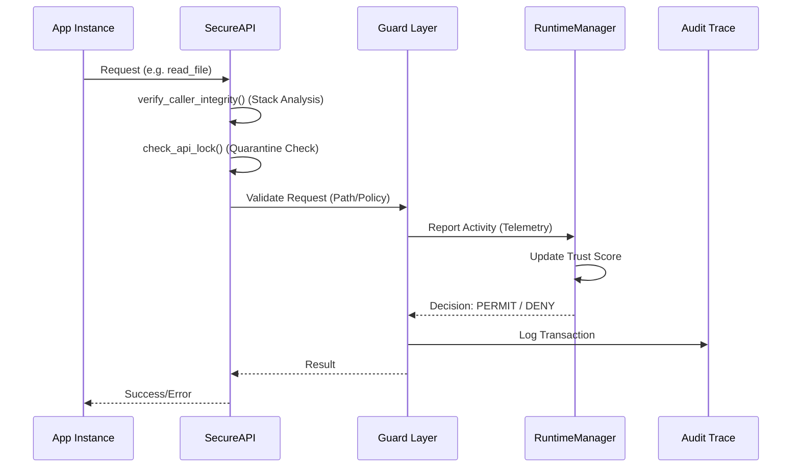

# Q-VAULT OS: ARCHITECTURE MASTER MAP
## Forensic Blueprint of a Governed Runtime Environment

This document serves as the high-level map of the Q-Vault architecture. It is designed for senior engineers and academic auditors to understand the system's structural integrity and decision-making logic.

---

### 1. FULL SYSTEM TOPOLOGY
The Q-Vault architecture follows a **Mediated Micro-Kernel** approach where the core system logic is decoupled from both the UI and the Application execution space.

---

### 2. COMPLETE RUNTIME LIFECYCLE
The system governs applications from instantiation to garbage collection through a multi-phase trust model.

1.  **Launch Request:** Emitted via `REQ_APP_LAUNCH` on the `EVENT_BUS`.
2.  **Spawning Transaction:** `AppRuntimeManager` initializes the `AppWorker` in a separate thread.
3.  **API Injection:** A unique `SecureAPI` instance is bound to the process with a specific `instance_id`.
4.  **Behavioral Monitoring:** Telemetry engine tracks resource usage and API call frequency.
5.  **Trust Adjustment:** `AppRuntimeManager` recalculates the trust score based on behavior.
6.  **Governor Masking:** `ProcessGovernor` aliases the OS process to a cinematic identity.
7.  **Quarantine (Optional):** If trust < threshold, the API is locked and a UI overlay is triggered.
8.  **Termination:** Graceful signal sent to the worker thread; resources are deallocated.
9.  **Cleanup:** Memory map is wiped; process entry removed from `RuntimeManager`.

---

### 3. FULL SECURITY PIPELINE (The "Governed Path")
Every sensitive request follows this mandatory sequence:

---

### 4. THREADING MAP
Q-Vault operates on a highly concurrent model to prevent UI stalls:

*   **Main Thread:** PyQt5 Event Loop + Window Rendering + User Input.
*   **Kernel Thread:** Background health monitor + `EventBus` housekeeping.
*   **App Worker Threads:** Each application instance runs its logic in a dedicated `QThread`.
*   **Forensic Thread:** Telemetry aggregation and non-blocking audit logging.

---

### 5. KNOWN ENGINEERING CONSTRAINTS
*As a research-grade prototype, Q-Vault acknowledges the following architectural boundaries:*

1.  **Python GIL:** Multi-threading is subject to the Global Interpreter Lock; intensive CPU tasks in apps may impact global throughput.
2.  **User-Space Isolation:** Sandboxing is enforced via logic wrappers and stack-trace analysis, not OS-level containers (cgroups/namespaces).
3.  **Simulated Hardware:** Hardware token and encrypted storage are cryptographically simulated for demonstration.
4.  **UI Blocking:** PyQt5 signal-slot mechanisms are used for cross-thread UI updates; excessive UI traffic from workers can cause lag.
5.  **In-Memory Mapping:** The `ProcessGovernor` mapping is transient and not persisted between system restarts in the current version.

---

**Architecture Status:** [VERIFIED - STABLE]  
**Signature:** `qv-master-map-v1.0-final`
