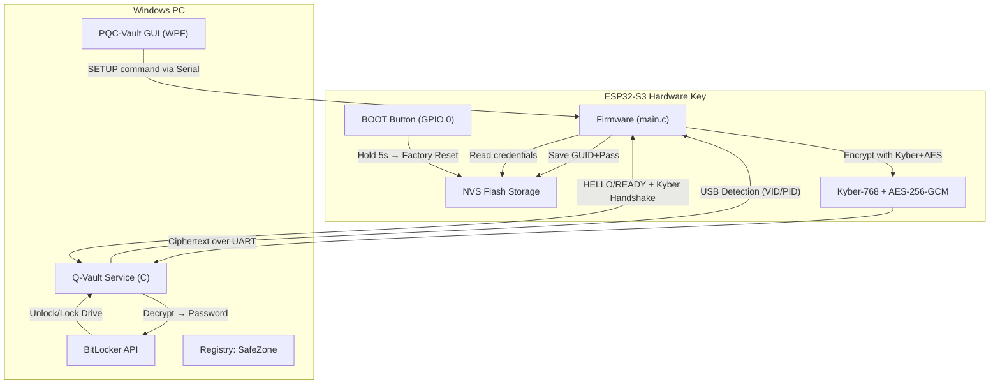
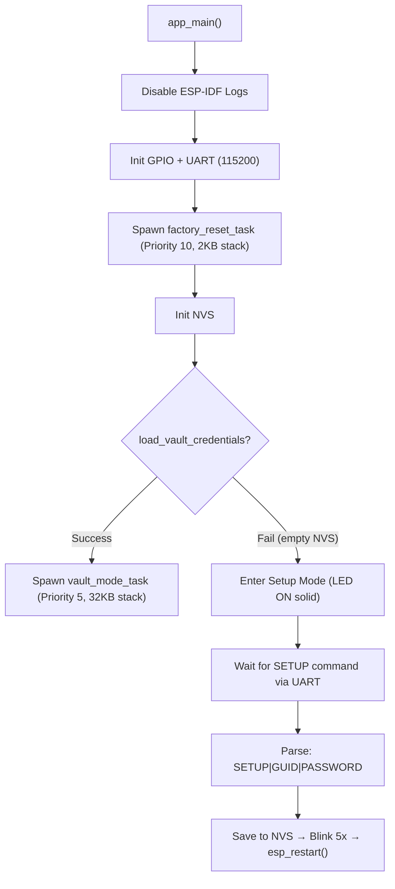
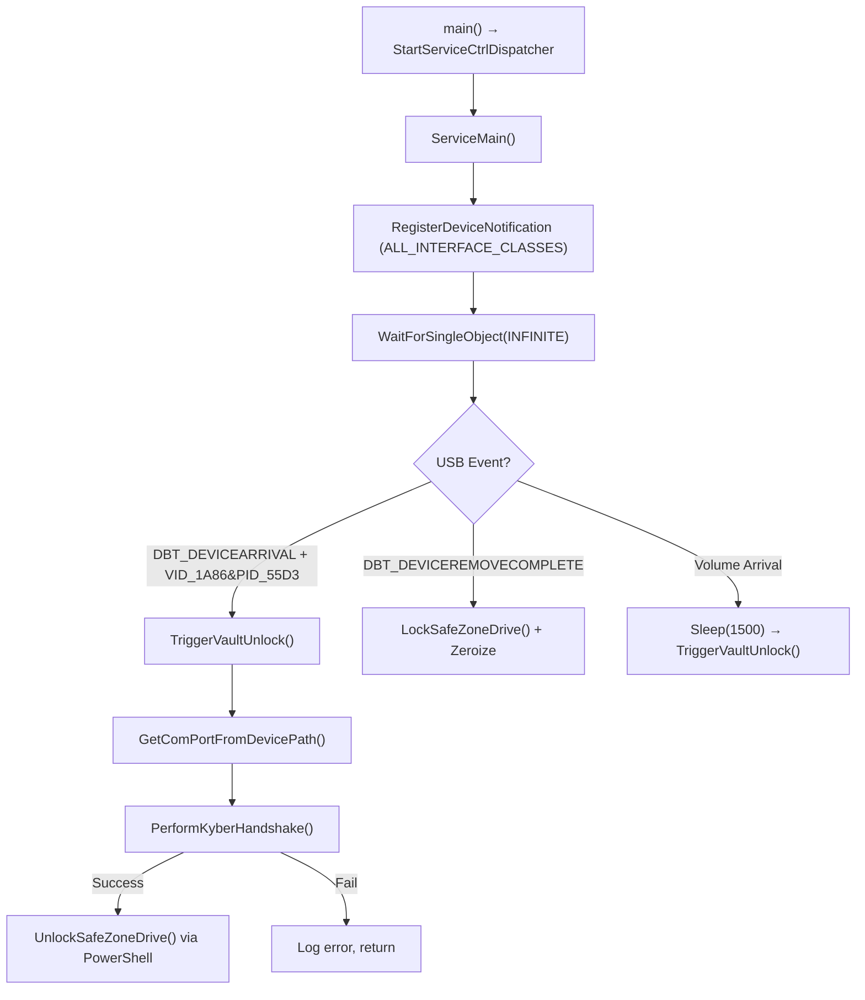
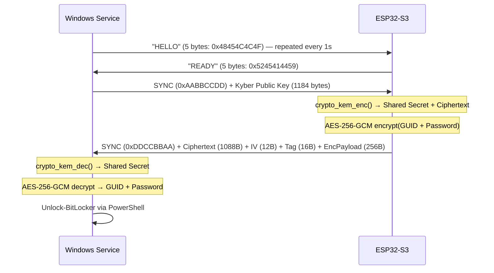

# 📘 Q-Vault — Technical Documentation (Complete Reference)

## 1. System Overview

**Q-Vault** is a hardware-bound, post-quantum encrypted BitLocker unlock system. It consists of three projects working together:

| Project | Location | Language | Purpose |
|---------|----------|----------|---------|
| **Q-Vault Service** | `source\repos\Q-vault\Q-vault` | C (Visual Studio) | Windows background service that detects the USB key and unlocks BitLocker |
| **Q-Vault ESP** | `Documents\PlatformIO\Projects\Q-Vault-ESP` | C (PlatformIO/ESP-IDF) | ESP32-S3 firmware that stores credentials and performs PQC handshake |
| **PQC-Vault GUI** | `source\repos\PQC-Vault-GUI\PQC-Vault` | C# WPF | Provisioning UI for selecting drives and flashing credentials to ESP32 |

---

## 2. Architecture Diagram



---

## 3. Project 1: Q-Vault ESP Firmware

**Path:** `C:\Users\ufo91\Documents\PlatformIO\Projects\Q-Vault-ESP`
**Board:** ESP32-S3-DevKitC-1 | **Framework:** ESP-IDF | **Flash:** 16MB

### 3.1 File Map

| File | Purpose |
|------|---------|
| `src/main.c` (287 lines) | Entry point, UART init, Setup Mode, Vault Mode task, Factory Reset task |
| `src/crypto_handshake.c` (70 lines) | Kyber-768 encapsulation + AES-256-GCM encryption of credentials |
| `src/nvs_vault.c` (69 lines) | NVS read/write/erase for GUID and password |
| `include/crypto_handshake.h` | `VaultPayload` struct (128B GUID + 128B password, packed) |
| `include/nvs_vault.h` | API: `init`, `save`, `load`, `clear` credentials |
| `platformio.ini` | Board config, 115200 baud, custom partitions |
| `partitions.csv` | NVS=64KB, PHY=4KB, Factory App=4MB |
| `components/kyber/` | PQClean ML-KEM-768 standalone implementation |

### 3.2 Boot Flow (app_main)



### 3.3 FreeRTOS Tasks

| Task | Stack | Priority | Function |
|------|-------|----------|----------|
| `vault_mode_task` | 32KB | 5 | Listens for HELLO, performs Kyber handshake, sends encrypted payload |
| `factory_reset_task` | 2KB | 10 | Monitors BOOT button (GPIO 0) continuously. Hold 5s → wipe NVS + restart |

### 3.4 Factory Reset Mechanism

- **Button:** BOOT (GPIO 0), present on all ESP32-S3 dev boards
- **Trigger:** Hold for ≥5 seconds at **any time** (works in both Vault and Setup mode)
- **Visual feedback:** LED blinks rapidly while held; 3 fast blinks on successful wipe
- **Action:** `clear_vault_credentials()` → `nvs_erase_all()` → `esp_restart()`
- After restart, NVS is empty → device enters Setup Mode automatically

### 3.5 NVS Storage Schema

| Namespace | Key | Type | Content |
|-----------|-----|------|---------|
| `qvault_sec` | `v_guid` | String | BitLocker Volume GUID (e.g. `\\?\Volume{...}\`) |
| `qvault_sec` | `v_pass` | String | BitLocker password (plaintext in NVS flash) |

### 3.6 LED Status Codes

| Pattern | Meaning |
|---------|---------|
| Solid ON | Setup Mode (awaiting provisioning) |
| 5 fast blinks (50ms) | Handshake success / Setup success |
| 3 medium blinks (300ms) | Handshake crypto error |
| 2 long blinks (800ms) | SYNC mismatch or incomplete data |
| Rapid toggle while holding BOOT | Factory reset countdown in progress |
| 3 very fast blinks (80ms) | Factory reset confirmed and executed |

---

## 4. Project 2: Q-Vault Windows Service

**Path:** `c:\Users\ufo91\source\repos\Q-vault\Q-vault`
**Toolchain:** Visual Studio 2022, MSVC v143, x64

### 4.1 File Map

| File | Lines | Purpose |
|------|-------|---------|
| `main_service.c` | 171 | Windows Service entry, USB event handler, unlock/lock orchestration |
| `serial_comm.c` | 209 | Full Kyber-768 handshake over COM port (key gen, HELLO/READY, SYNC, decrypt) |
| `serial_comm.h` | 19 | `VaultPayload` struct + `PerformKyberHandshake()` prototype |
| `crypto_utils.c` | 131 | BCrypt wrappers: AES-256-GCM decrypt, SHA-256, HMAC-SHA256, nonce gen |
| `crypto_utils.h` | 15 | Crypto API declarations |
| `hardware_manager.c` | 46 | COM port discovery via SetupAPI (VID/PID matching) |
| `vault_bitlocker.c` | 115 | BitLocker unlock/lock via PowerShell subprocess with piped password |
| `safezone.c` | 164 | WLAN BSSID fingerprinting (**currently disabled** in main_service.c) |
| `logger.c` | 11 | Append-mode file logger → `C:\Users\ufo91\Desktop\QvaultLog.txt` |
| `setup_safezone.ps1` | 60 | PowerShell script to scan Wi-Fi and store BSSID hashes in Registry |
| `kyber/` | — | Local copy of PQClean ML-KEM-768 (standalone, no external deps) |

### 4.2 Service Lifecycle



### 4.3 Anti-Duplicate Event Protection

The service uses `GetTickCount()` debouncing (5-second window) to prevent Windows from firing multiple rapid USB events for a single physical insert/remove.

### 4.4 BitLocker Integration

- **Unlock:** Spawns hidden PowerShell process with `Unlock-BitLocker -MountPoint`. Password is piped via stdin (never appears on command line).
- **Lock:** Spawns hidden PowerShell process with `Lock-BitLocker -Force`.
- **Verification:** `GetVolumeInformationW()` checks if drive is actually accessible after unlock.

### 4.5 SafeZone (Currently Disabled)

SafeZone was designed to verify physical location by matching nearby Wi-Fi BSSIDs against stored SHA-256 hashes in Registry (`HKLM:\SOFTWARE\QVault\SafeZone`). **Disabled** because Windows caches WLAN scan results, causing false `ACCESS DENIED` when changing networks. The code and setup script remain in the codebase for potential future re-enablement.

---

## 5. Project 3: PQC-Vault GUI

**Path:** `c:\Users\ufo91\source\repos\PQC-Vault-GUI\PQC-Vault`
**Framework:** WPF (.NET) | **Language:** C#

### 5.1 File Map

| File | Purpose |
|------|---------|
| `MainWindow.xaml` | UI layout (dark theme, glassmorphism) |
| `MainWindow.xaml.cs` | Device detection, drive enumeration, serial provisioning |
| `BitLockerManager.cs` | WMI-based BitLocker operations |

### 5.2 Key Features

- **Auto-detection:** Polls WMI every 1 second for USB device with `VID_1A86&PID_55D3`
- **BitLocker drive picker:** Enumerates `Win32_EncryptableVolume` via WMI
- **Password modes:** Manual entry or auto-generated 32-char cryptographic password
- **Recovery key export:** Forces saving a `.txt` recovery file before provisioning
- **Serial provisioning:** Sends `setup|GUID|PASSWORD\n` to ESP32 at 115200 baud
- **Simulation mode:** Checkbox to test UI flow without physical hardware

---

## 6. The Handshake Protocol (Byte-Level Detail)

### 6.1 Sequence Diagram



### 6.2 Wire Format

**Windows → ESP32 (1188 bytes total):**
```
[0xAA][0xBB][0xCC][0xDD] [Public Key: 1184 bytes]
```

**ESP32 → Windows (1376 bytes total):**
```
[0xDD][0xCC][0xBB][0xAA] [Kyber Ciphertext: 1088 bytes] [AES IV: 12 bytes] [AES Tag: 16 bytes] [Encrypted VaultPayload: 256 bytes]
```

**VaultPayload struct (256 bytes, packed):**
```c
typedef struct {
    char guid[128];     // BitLocker Volume GUID
    char password[128]; // BitLocker password
} VaultPayload;
```

### 6.3 Cryptographic Parameters

| Parameter | Value |
|-----------|-------|
| KEM Algorithm | ML-KEM-768 (NIST FIPS 203) |
| Public Key Size | 1184 bytes |
| Secret Key Size | 2400 bytes |
| Ciphertext Size | 1088 bytes |
| Shared Secret Size | 32 bytes |
| Symmetric Cipher | AES-256-GCM |
| IV Size | 12 bytes (random, `esp_fill_random`) |
| Tag Size | 16 bytes |
| Payload Size | 256 bytes |

---

## 7. Security Architecture

### 7.1 Threat Model

| Threat | Mitigation |
|--------|------------|
| USB sniffing / MITM | ML-KEM-768 key exchange — fresh keypair per session |
| Quantum computing | Post-quantum KEM (NIST standardized) |
| Stolen ESP32 (no laptop) | Useless without the paired Windows service |
| Stolen laptop (no ESP32) | BitLocker remains locked |
| RAM dumping | `mbedtls_platform_zeroize()` on ESP32, `SecureZeroMemory()` on Windows |
| Password on command line | Piped via stdin to PowerShell, never in process args |
| ESP-IDF log leaking binary data | All ESP logs disabled: `esp_log_level_set("*", ESP_LOG_NONE)` |
| Stack overflow during Kyber ops | Dedicated 32KB FreeRTOS task + heap allocation for large buffers |

### 7.2 Memory Safety

- **ESP32:** All Kyber buffers (`shared_secret`, `VaultPayload`) allocated via `heap_caps_malloc` on internal SRAM, zeroed with `mbedtls_platform_zeroize` after use.
- **Windows:** All secrets (`extractedPassword`, `shared_secret`, `rx_buffer`, `secret_key`) wiped with `SecureZeroMemory` after use.

---

## 8. Setup Guide (From Scratch)

### Step 1: Flash ESP32 Firmware
```
1. Open Q-Vault-ESP in PlatformIO
2. Build → Upload
3. Open Serial Monitor (115200 baud)
4. LED should be SOLID ON (Setup Mode)
```

### Step 2: Provision via GUI
```
1. Open PQC-Vault GUI (Run as Administrator)
2. Insert ESP32 — status shows "Active on COMx"
3. Select target BitLocker drive from dropdown
4. Choose password mode (Manual or Auto-Generate)
5. Click "Provision" → GUI sends SETUP command
6. ESP32 blinks 5x and restarts into Vault Mode
```

### Step 3: Build & Install Windows Service
```
1. Open Q-vault.sln in Visual Studio
2. Build (x64 Release)
3. Install: sc create QVault binPath= "C:\path\to\QVault.exe" start= auto
4. Start: sc start QVault
```

### Step 4: Usage
```
Insert ESP32 USB key → Service detects → Kyber handshake → BitLocker unlocks
Remove ESP32 USB key → Service detects → BitLocker locks
```

### Factory Reset
```
Hold BOOT button on ESP32 for 5+ seconds (LED blinks rapidly)
→ 3 fast blinks confirm wipe
→ ESP32 restarts in Setup Mode (LED solid ON)
→ Re-provision with GUI
```

---

## 9. Build Dependencies

### ESP32 Firmware
- PlatformIO Core
- Espressif32 platform (ESP-IDF framework)
- PQClean ML-KEM-768 (bundled in `components/kyber/`)
- mbedTLS (bundled with ESP-IDF)

### Windows Service
- Visual Studio 2022 (v143 toolset)
- Windows SDK 10.0
- Libraries: `bcrypt.lib`, `setupapi.lib`, `wlanapi.lib`
- PQClean ML-KEM-768 (local copy in `kyber/` folder)

### GUI
- .NET Framework (WPF)
- System.Management (WMI)
- System.IO.Ports (Serial)

---

## 10. Known Issues & Future Work

### Current Known Issues
- **Double-click provisioning:** GUI may require clicking Provision twice (once for BitLocker encrypt, once for ESP32 flash). Needs investigation.
- **SafeZone disabled:** WLAN caching makes BSSID fingerprinting unreliable when switching networks.
- **Logger path hardcoded:** `C:\Users\ufo91\Desktop\QvaultLog.txt` — should use `%APPDATA%` or Event Log.

### Planned Improvements
- [ ] TPM attestation for additional hardware binding
- [ ] Configuration UI for SafeZone fingerprint enrollment
- [ ] Automated tests for cryptographic functions
- [ ] Proper Windows Event Log integration
- [ ] Service installer with ACL hardening on Registry keys
- [ ] Encrypted NVS partition on ESP32 (eFuse-based)
- [ ] Multi-drive support (multiple GUID/password pairs)

---

> *This documentation reflects the system state as of 2026-05-01. All source code paths and behaviors are verified against the actual codebase.*
