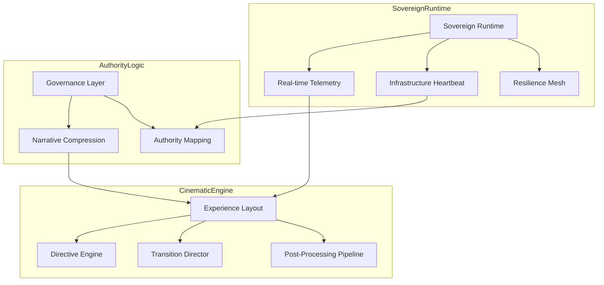

# Q-VAULT 🏛️ Sovereign Infrastructure Authority

Q-VAULT is a globally deployed, institutional-grade security platform designed for the post-quantum era. This experience serves as the authoritative interface for sovereign infrastructure management, archival preservation, and executive oversight.

---

## 🛰️ Deployment Routes

The system operates across multiple specialized deliverable states, each optimized for specific institutional stakeholders.

### 🗺️ Infrastructure Routing
- **`/authority`**: High-authority operational HUD with global deployment telemetry.
- **`/operations`**: The Archival Operations Center console for real-time monitoring.
- **`/executive`**: Minimalist, high-legitimacy interface for executive briefing.
- **`/investor`**: Presentation-safe environment with compliance-grade visuals.
- **`/museum`**: Deterministic playback mode for long-term institutional archival.
- **`/kiosk`**: High-resilience, loop-safe deployment for physical installations.
- **`/press`**: High-impact cinematic flow for media and public engagement.

---

## 🏛️ System Architecture

---

## 🏛️ Core Technologies

- **Simulation**: 20Hz Sovereign Runtime (Deterministic)
- **Visuals**: React Three Fiber / Three.js (Retinal Exposure, Cryo-Scattering)
- **Governance**: Directive Engine (Cinematic Restraint governance)
- **Hardening**: Phase XVII Production Stabilization

---

## 🛠️ Production Constraints

- **Zero-Allocation**: All frame loops in `CameraRig` and `PostFX` use pre-allocated buffers.
- **Institutional Silence**: Near-zero bloom and aberration in authority modes.
- **Resilience**: Full WebGL context recovery and mobile fallback path enabled.

---

## 📽️ Presentation Flow (PPTX Mapping)

1. **SLIDE 1**: *The Silence*. Path: `/executive`. Concept: Sovereignty.
2. **SLIDE 2**: *The Reach*. Path: `/authority`. Concept: Global Scale.
3. **SLIDE 3**: *The Root*. Scene: 10. Concept: Hardware Integrity.
4. **SLIDE 4**: *The Audit*. Path: `/operations`. Concept: Transparency.
5. **SLIDE 5**: *The Seal*. Scene: 12. Concept: Eternity.

---

© 2026 Q-VAULT INSTITUTIONAL. ALL RIGHTS RESERVED.
