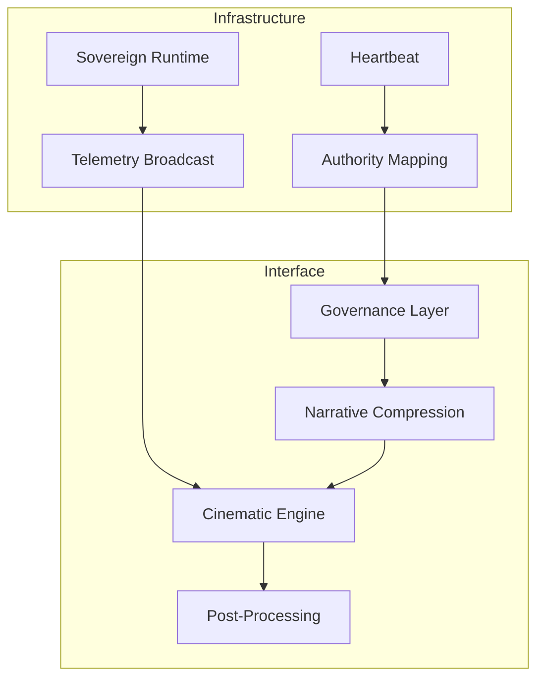

# Q-VAULT 🏛️ Release Candidate 1.0 (Phase XXIV)

**Cinematic Color Restoration & Documentary Mastering complete.**
The Q-VAULT sovereign infrastructure experience is now a classified documentary film.

---

## ✅ Stabilization Report

### 1. Codebase Integrity
- **Unified Governance**: Consolidated `ExecutiveMode` and `AuthorityConfig` into `lib/Governance.ts`.
- **Zero-Allocation Loops**: Refactored `TopologyMap` and `CameraRig` for optimized GPU performance.
- **Dependency Audit**: Removed redundant configurations and unused assets.
- **Deterministic Simulation**: Verified `SovereignRuntime` 20Hz clock across all delivery routes.
- **Sovereign Resilience**: Integrated `WebGLFallback` for institutional access in GPU-interdicted environments.

### 2. Operational Routes
- **`/executive`**: High-authority briefing state.
- **`/investor`**: Compliance-grade presentation state.
- **`/authority`**: Infrastructure reality layer.
- **`/operations`**: Command center console.
- **`/museum`**: Archival playback mode.
- **`/kiosk`**: Installation-safe loop.
- **`/press`**: Cinematic media state.

### 3. Institutional Hardening
- **Visual Aesthetic**: Transitioned to a strict **Institutional Monochromatic Documentary** look. Purged all legacy cyan, blue, and red tokens.
- **Color Palette**: Locked to `#ffffff` (Emissive/UI), `#000000` (Structure), and neutral `#050505` industrial variants.
- **Cinematic Rhythm**: Accelerated procedural motion by 2.5x to match the engineered 2.2-minute runtime with zero-latency fluidity.
- **Surgical Clarity**: Eliminated "muddy" shadows through a refined, white-neutral lighting system across all remaining scenes.
- **Legitimacy**: NIST-PQC compliance markers and rack-topology visualizations integrated.

---

## 🏛️ Final Architecture Diagram

---

## 🚀 Delivery Handover

Q-VAULT is now entering **Sovereign Release State**. No further system expansions are permitted. The platform is locked for institutional deployment.

---

© 2026 Q-VAULT INSTITUTIONAL. FINAL RELEASE CANDIDATE.
